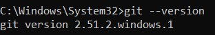
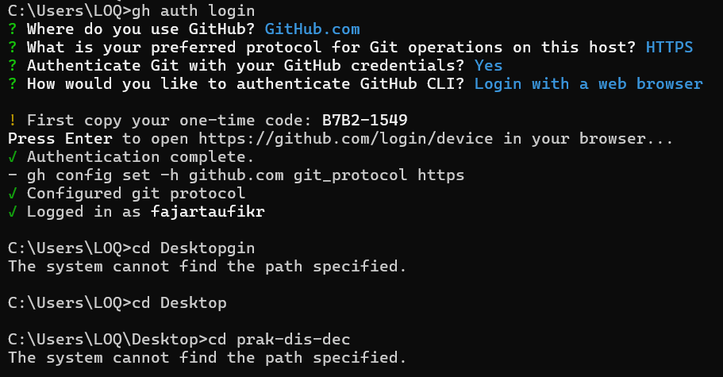
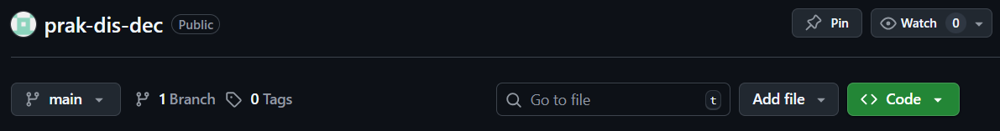
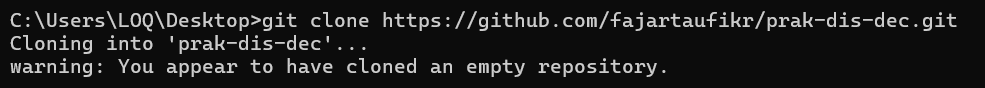
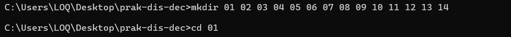
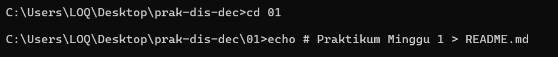
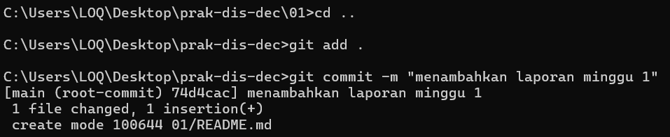
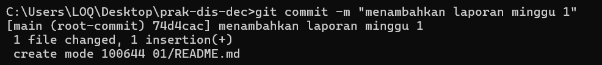
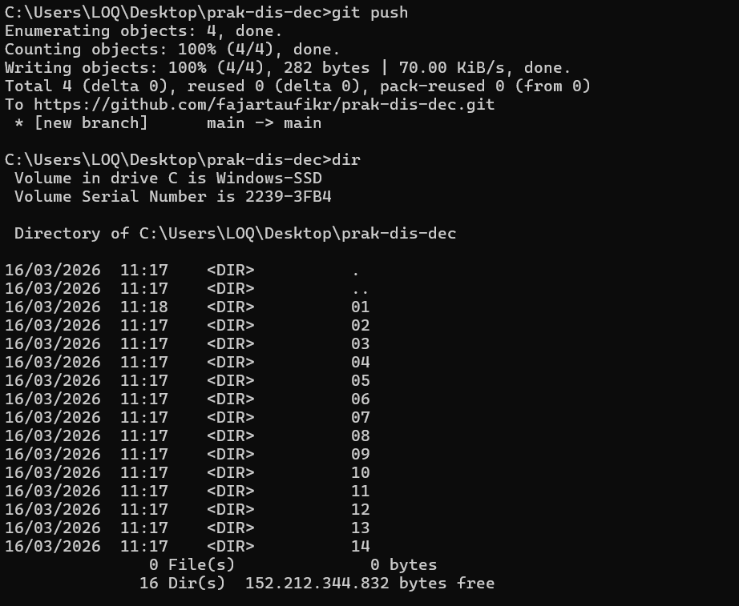

Praktikum Minggu 1 - Pengenalan Git dan GitHub

Nama  : FAJAR TAUFIK ROMADHON

NIM   : 235410072

Kelas : IF-1

Mata Kuliah : PRAKTIKUM SISTEM TERDISTRIBUSI DAN TERDESENTRALISASI

Langkah langkah : 
1. Installasi Git

   Dikarenakan saya sudah menginstall, hanya pengecekan versi Git dengan :

       git --version
    
    ## Screenshot
    

2. Konfigurasi Git

         git config --global user.name "fajartaufikr"

         git config --global user.email "fajartaufik545@gmail.com"

    ## Screenshot
    

3. Membuat Repository di GitHub

    Membuat rapository di GitHub dengan nama "prak-dis-dec", digunakan untuk menyimpan semua laporan praktikum.

    ## Screenshot
    

4. Clone Repository
 
   Repository yg dibuat kemudian diclone menggunakan perintah :

       git clone https://github.com/fajartaufikr/prak-dis-dec.git

    Setelah itu masuk ke folder repository :

       cd prak-dis-dec
    
    ## Screenshot
    

5. Membuat Struktur Folder Praktikum

   Membuat folder untuk setiap minggu praktikum :

        mkdir 01 02 03 04 05 ... dst.

    ## Screenshot
    

6. Membuat file README.md

    Masuk ke folder minggu pertama :

          cd 01
   
   Membuat file laporan :
   
          echo # Praktikum Minggu 1 > README.md

    ## Screenshot
    

7. Menambahkan File ke Git

    Menambahkan semua perubahan ke staging area :

         git add .

    ## Screenshot
    

8. Commit Perubahan

    Menyimpan perubahan dengan pesan commit :

        git commit -m "menambahkan laporan praktikum minggu 1"

    ## Screenshot
    

9. Upload ke GitHub

    Mengupload file ke repository GitHub :

        git push

    ## Screenshot
    

Kesimpulan

Pada praktikum minggu pertama ini, saya mempelajari dasar penggunaan Git dan GitHub. Saya berhasil membuat repository, melakukan clone repository, membuat struktur folder praktikum, serta melakukan commit dan push ke GitHub.
