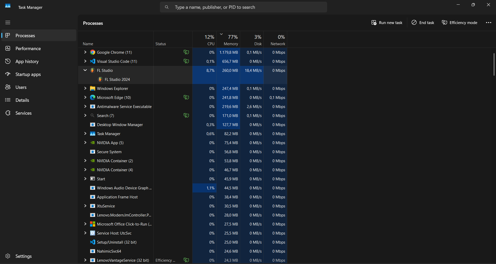
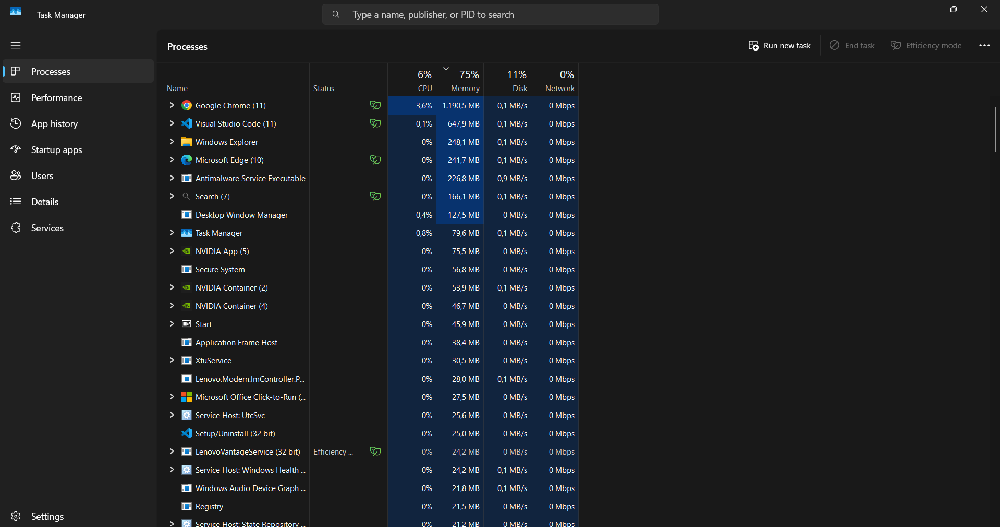
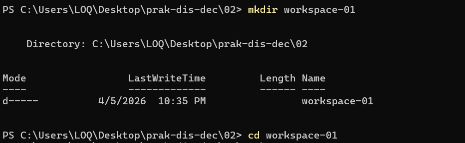
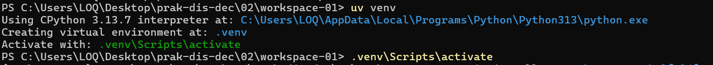
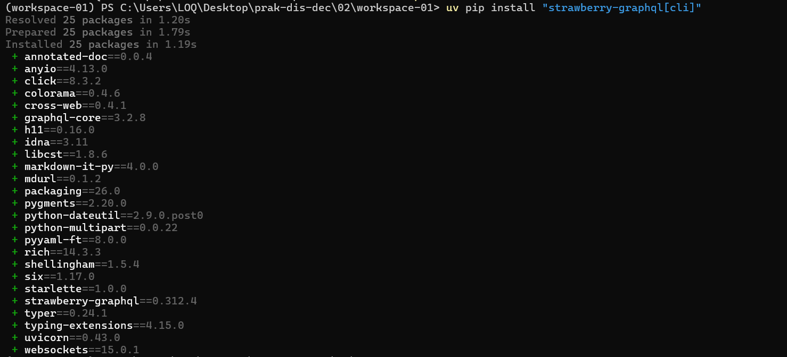
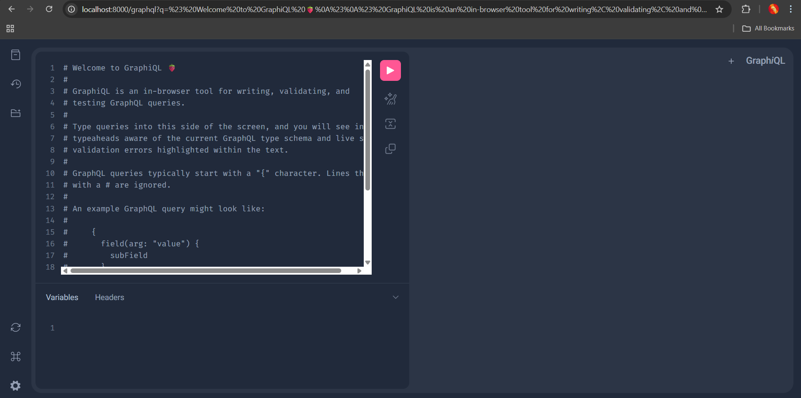
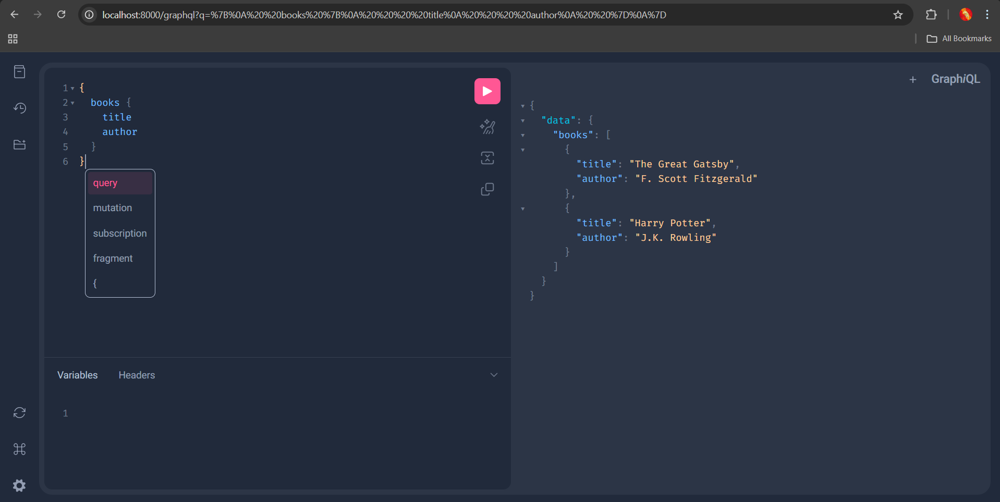
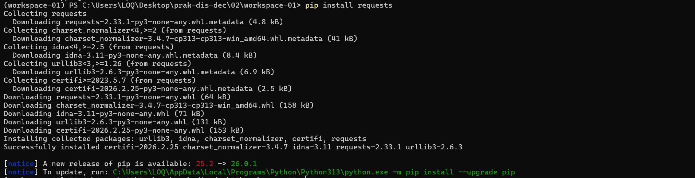
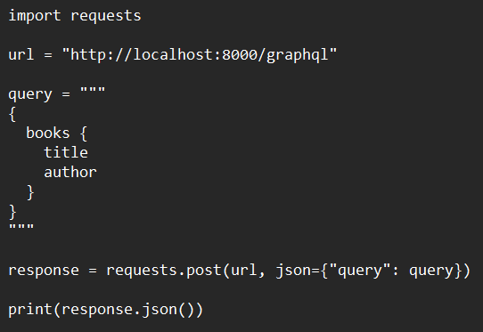
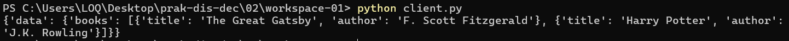

# Praktikum Minggu 2 - Komunikasi Antar Proses pada Sistem Terdistribusi 

Nama  : FAJAR TAUFIK ROMADHON

NIM   : 235410072

Kelas : IF-1

Mata Kuliah : PRAKTIKUM SISTEM TERDISTRIBUSI DAN TERDESENTRALISASI

## Pengantar 
Proses merupakan hasil dari eksekusi program / aplikasi yang bersifat executable.
Proses dikelola oleh sistem operasi dan terdiri atas executable code, data, resources, serta
informasi tentang state (stack dan heap). Setiap aplikasi yang dijalankan akan menjadi proses.

## Tujuan Praktikum
1. Memahami konsep proses dalam sistem operasi
2. Mengamati proses yang berjalan pada komputer
3. Memahami komunikasi antar proses pada sistem terdistribusi
4. Menggunakan GraphQL sebagai media komunikasi

## Langkah langkah Praktikum: 

## I. Proses pada Satu Node

### 1. Menampilkan Proses
Saya menggunakan Task Manager untuk melihat proses yang berjalan di komputer.

Langkah:
- Tekan `Ctrl + Shift + Esc`
- Masuk ke tab **Processes**

---

### 2. Menjalankan Aplikasi
Saya menjalankan aplikasi **FL Studio 2024**

Kemudian melihat proses yang muncul di Task Manager.

 
---

### 3. Mematikan Proses
Saya mematikan proses FL Studio 2024 melalui Task Manager:

Langkah:
- Klik kanan pada FL Studio 2024
- Pilih **End Task**

    

---

### 4. Penjelasan
Proses adalah program yang sedang berjalan. Sistem operasi mengatur semua proses seperti alokasi memori dan CPU.

---

## II. Komunikasi Antar Proses (GraphQL)

### 1. Instalasi Strawberry GraphQL
    uv pip install "strawberry-graphql[cli]"
 
### 2. Buat workspace dengan nama workspace-01. Pada workspace tersebut, gunakan Python versi 3.14.3 

### 3. Buat environment, aktifkan environment yang sudah anda buat tersebut. 

### 4. Instalasi paket-paket yang diperlukan:

### 5. Jalankan source code yang sudah disediakan (schema.py):

### 6. Pada tempat yang tersedia (di sisi kiri), tuliskan query berikut:
    {
        books {
            title
            author
        }
    }

### 7. Klik pada tombol run. Lihat hasilnya di sebelah kanan.

# TUGAS 
Buatlah client menggunakan bahasa pemrograman bebas. Client tersebut mengakses GraphQL server yang sudah dibuat di atas. 

### 1. Install Library Requests
    pip install requests

### 2. Buat File client.py

### 3. Jalankan client.py

Client digunakan untuk mengirim permintaan (request) ke server dan menerima data sebagai respons. Pada praktikum ini, client berfungsi untuk mengakses GraphQL server yang telah dibuat, kemudian mengirim query untuk mengambil data buku. Setelah itu, client akan menampilkan hasil yang diterima dari server dalam bentuk JSON. Dengan adanya client, komunikasi antara pengguna dan server dapat terjadi secara langsung.

## Kesimpulan

Pada praktikum ini, saya mempelajari konsep proses pada sistem operasi serta komunikasi antar proses pada sistem terdistribusi. Saya juga berhasil membuat GraphQL server menggunakan Strawberry dan mengaksesnya melalui client.
