# Praktikum Minggu 3 - Sinkronisasi pada Sistem Terdistribusi

Nama  : FAJAR TAUFIK ROMADHON

NIM   : 235410072

Kelas : IF-1

Mata Kuliah : PRAKTIKUM SISTEM TERDISTRIBUSI DAN TERDESENTRALISASI

## Pengantar 
Ada 2 protokol yang biasanya digunakan untuk sinkronisasi waktu: NTP (Network Time
Protocol) dan PTP (Precision Time Protocol).

## Langkah langkah Praktikum: 

### I. Sinkronisasi waktu

 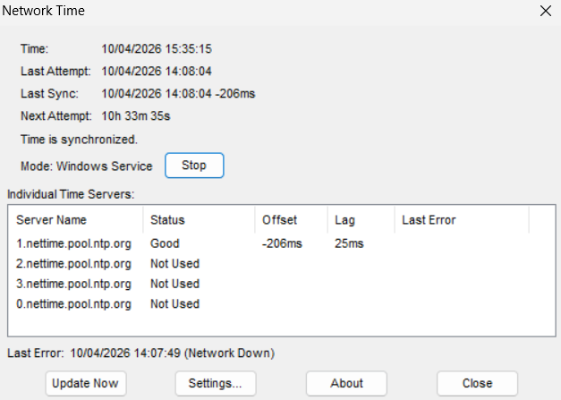

1. Install NetTime pada link berikut https://www.timesynctool.com/
2. Penjelasan

### II. Vector Clock
Vector clock digunakan untuk pengurutan event dalam suatu sistem terdistribusi. Berikutadalah contoh source code untuk vector clock (ada pada source code: vclocks.py). Source code diambil dari banyak sumber di Internet.

 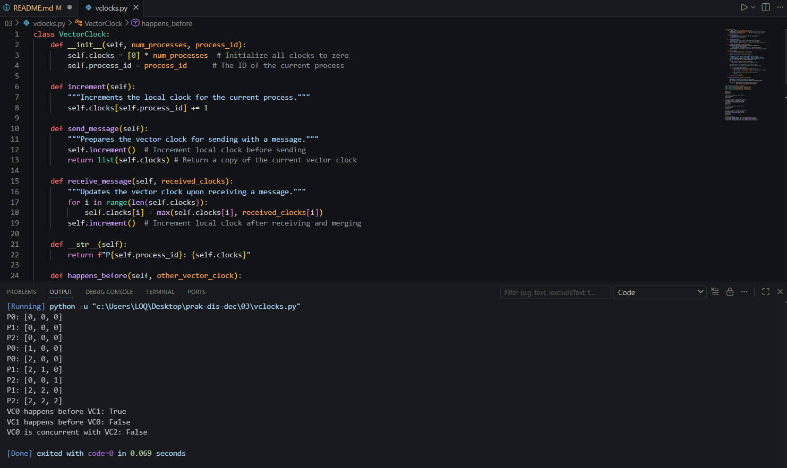

Tugas:
1. Jalankan program tersebut, amati keluarannya. Buat penjelasan dari keluaran tersebut: bandingkan dengan algoritma tersebut jika vector clocks dilaksanakan secara manual.
2. Buat modul Python untuk class VectorClock tersebut dan buatlah contoh cara menggunakan modul tersebut.
 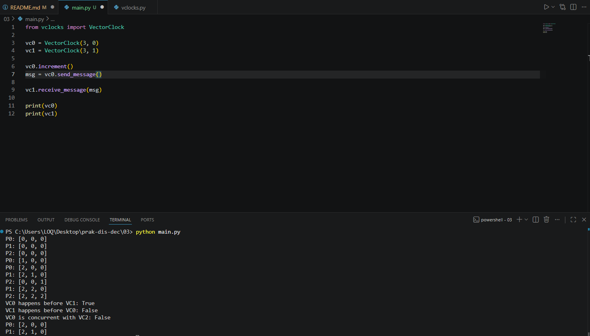
 Vector clock digunakan untuk menentukan urutan kejadian dalam sistem terdistribusi. Setiap proses memiliki array waktu sendiri. Ketika terjadi komunikasi antar proses, nilai waktu akan diperbarui sehingga urutan kejadian dapat diketahui secara konsisten.

### III. Problem Tanpa Sinkronisasi
Pada sistem terdistribusi, ketiadaan sinkronisasi bisa menghasilkan 2 masalah besar yaitu data race / race conditions dan deadlock. Pada program yang menggunakan model asynchronous maupun thread, pola pikir sekuensial tidak bisa digunakan karena penyelesaian satu task dengan task lainnya biasanya tidak bisa diprediksi. Berikut adalah
contoh program multithreaded di Python (multithreaded-example.py).

 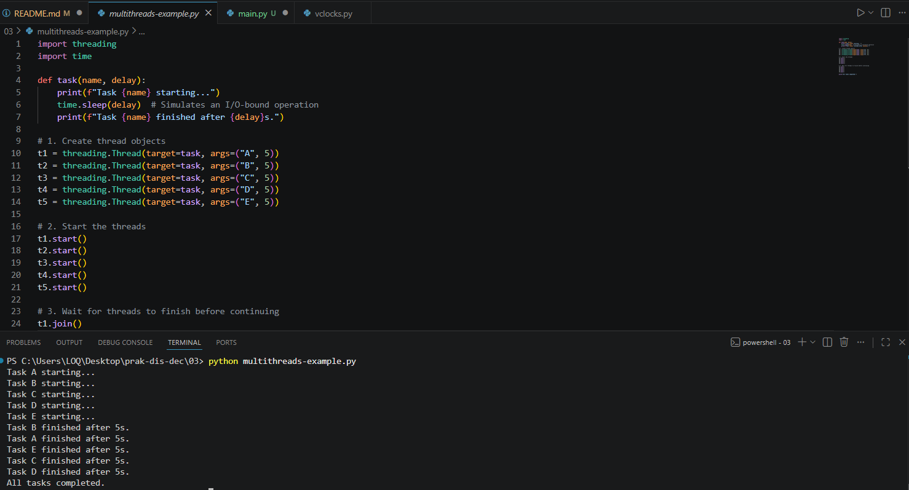

Tugas:
1. Jalankan program tersebut sampai anda mendapatkan keluaran yang berbeda.
2. Capture keluaran program tersebut dan jelaskan mengapa bisa berbeda.

### III.I Data Race / Race conditions
Berikut adalah contoh data race / race conditions di Python (race-conditions-01.py).

 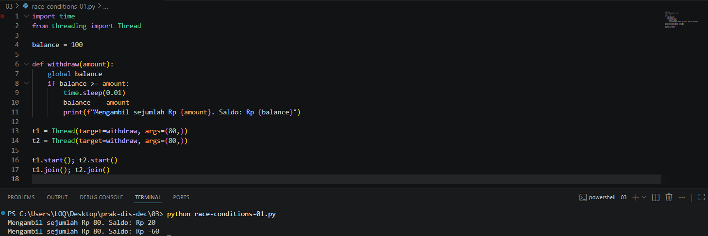

 Tugas:
1. Jalankan program tersebut.
2. Jelaskan menggunakan visualisasi (gambar dengan pensil/ballpoint kemudian difoto), mengapa terjadi data race /race conditions.

Race condition terjadi ketika beberapa thread mengakses data yang sama secara bersamaan tanpa sinkronisasi. Hal ini menyebabkan hasil yang tidak konsisten karena urutan eksekusi tidak dapat diprediksi.

Berikut adalah contoh program untuk membuat supaya race conditions tersebut tidak terjadi (race-conditions-02.py):

 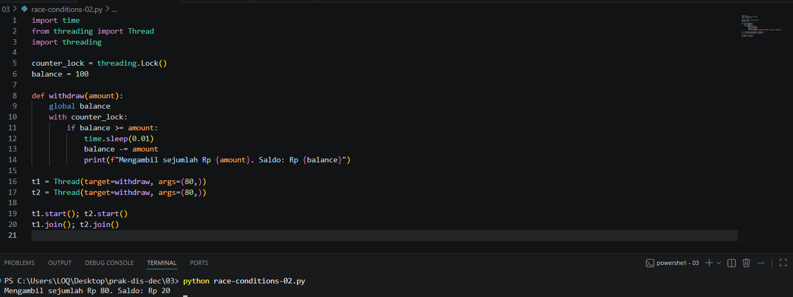

 Tugas:
1. Jalankan program tersebut
2. Amati keluarannya. Jelaskan mengapa race-conditions tidak terjadi?

Deadlock terjadi ketika dua atau lebih proses saling menunggu resource yang dimiliki oleh proses lain, sehingga tidak ada proses yang dapat melanjutkan eksekusi.

### III.II Deadlock
Berikut adalah contoh kondisi deadlock di Python (deadlock-01.py).

 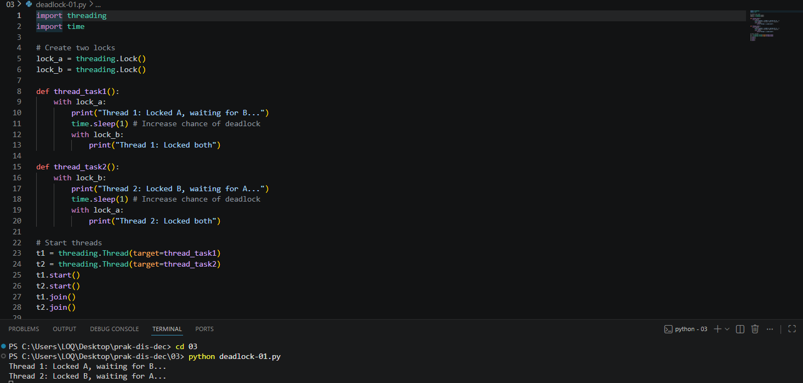

 Tugas:
1. Jalankan program tersebut.
2. Jelaskan menggunakan visualisasi (gambar dengan pensil/ballpoint kemudian difoto), mengapa terjadi deadlock.

Deadlock terjadi karena dua thread saling menunggu resource yang dimiliki oleh thread lain. Thread 1 mengunci resource A dan menunggu resource B, sedangkan Thread 2 mengunci resource B dan menunggu resource A. Akibatnya, kedua thread tidak dapat melanjutkan eksekusi dan program berhenti.

Berikut adalah contoh program untuk membuat supaya deadlock tersebut tidak terjadi (deadlock-02.py):

 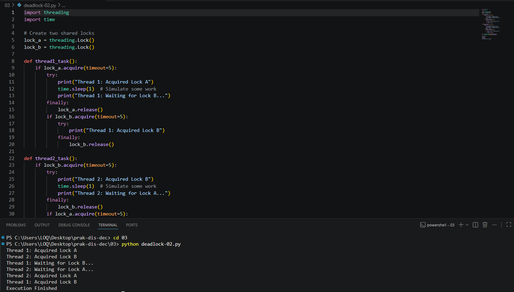

 Tugas:
1. Jalankan program tersebut
2. Amati keluarannya. Jelaskan mengapa deadlock tidak terjadi?

Deadlock tidak terjadi karena setiap thread tidak menahan dua resource secara bersamaan. Setelah mendapatkan satu lock, thread akan melepaskannya sebelum mencoba mendapatkan lock lainnya. Selain itu, penggunaan timeout pada proses acquire mencegah thread menunggu tanpa batas. Dengan demikian, kondisi saling menunggu (circular wait) dapat dihindari sehingga deadlock tidak terjadi.

### IV. Algoritma Raft
Algoritma Raft banyak digunakan pada sistem terdistribusi, antara lain digunakan untuk
mencapai konsensus. Berikut adalah simulasi algoritma Raft menggunakan Python yang diambil dari
https://www.c-sharpcorner.com/article/simulate-distributed-consensus-with-the-raft-protocol-simplified-using-python/.

 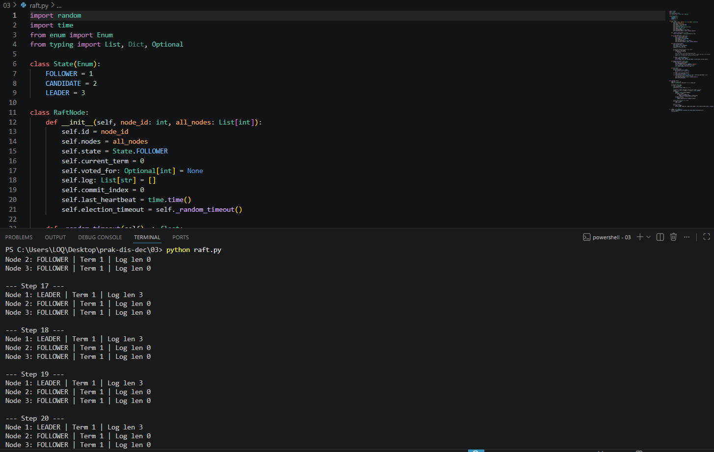

 Tugas:
1. Jalankan program tersebut.
2. Perhatikan keluaran program yang dijalankan tersebut. Dari keluaran program tersebut, jelaskan secara sederhana algoritma Raft untuk memilih koordinator (LEADER) menggunakan visualisasi (digambar dengan manual pensil/ballpoint dan kemudian difoto) .
 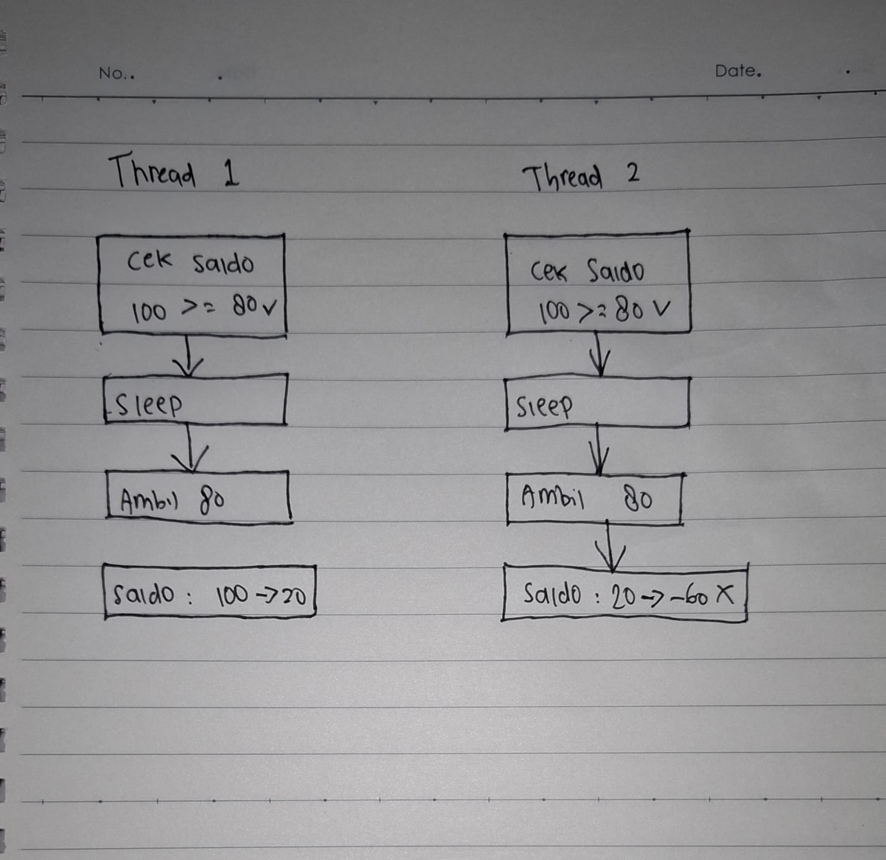
Pada gambar terlihat dua thread (Thread 1 dan Thread 2) berjalan secara bersamaan dan mengakses data yang sama, yaitu saldo sebesar 100. Kedua thread melakukan pengecekan kondisi saldo (100 ≥ 80) dan mendapatkan hasil benar, sehingga keduanya melanjutkan proses.
Namun, karena tidak ada mekanisme sinkronisasi, kedua thread membaca nilai saldo yang sama sebelum salah satu thread memperbaruinya. Setelah itu, kedua thread melakukan pengurangan sebesar 80 secara bersamaan.
Akibatnya, Thread 1 mengubah saldo dari 100 menjadi 20, sedangkan Thread 2 juga tetap menggunakan nilai lama (100) sehingga menghasilkan saldo akhir yang salah, yaitu -60.
Hal ini menunjukkan terjadinya race condition, yaitu kondisi ketika beberapa thread mengakses dan memodifikasi data yang sama secara bersamaan tanpa pengaturan yang tepat, sehingga menghasilkan data yang tidak konsisten.

3. Buatlah program tersebut menjadi modul Python dan kemudian buatlah contoh simulasinya menggunakan modul Python yang sudah anda buat tersebut.
 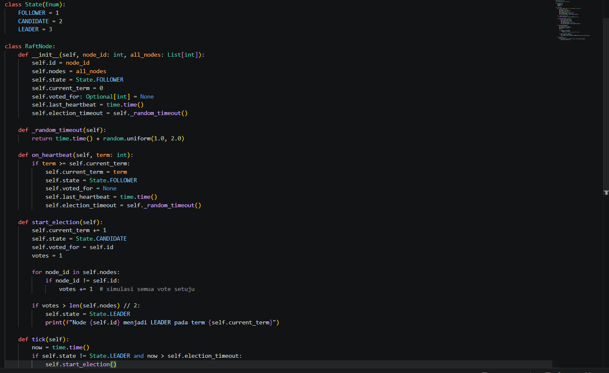
  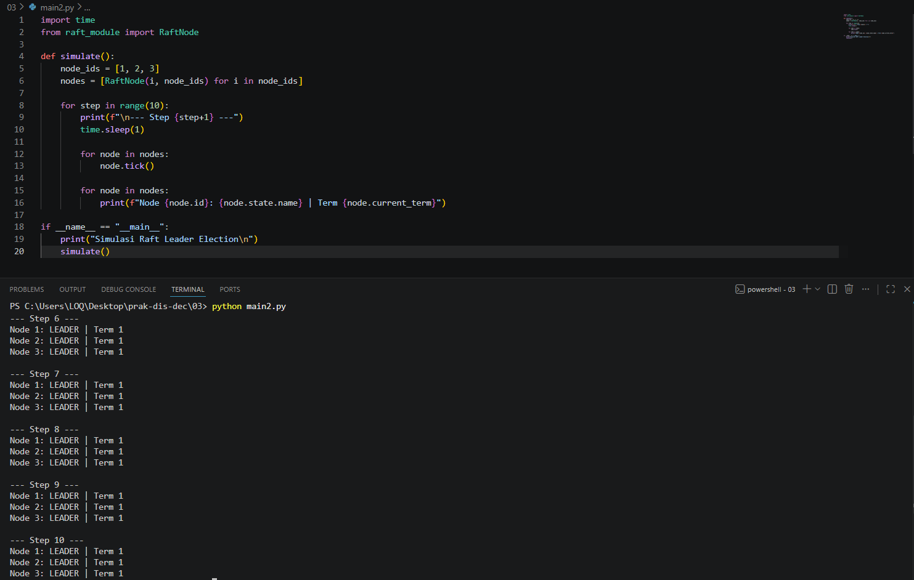
  Program dibuat dalam bentuk modul Python untuk memisahkan logika algoritma Raft dengan simulasi. Modul berisi class RaftNode yang mengatur state node, proses pemilihan leader, dan timeout. Pada simulasi, beberapa node dijalankan secara bersamaan dan akan melakukan pemilihan leader berdasarkan mekanisme voting. Node yang mendapatkan mayoritas suara akan menjadi leader.