# Praktikum Minggu 3 - Konsistensi dan Replikasi pada Sistem Terdistribusi

Nama  : FAJAR TAUFIK ROMADHON

NIM   : 235410072

Kelas : IF-1

Mata Kuliah : PRAKTIKUM SISTEM TERDISTRIBUSI DAN TERDESENTRALISASI

## Pengantar 
Materi ini membahas tentang cara mengkonfigurasi streaming replication di PostgreSQL 18.
Secara prinsip, sebenarnya sama dengan versi-versi PostgreSQL sebelumnya, hanya saja
letak dari direktori data bukan di /var/lib/postgresql/data lagi tapi berubah di
/var/lib/postgresql/18/docker. Materi ini ditulis berdasarkan materi pada https://medium.com/@eremeykin/how-to-setup-single-primary-postgresql-replication-with-do
cker-compose-98c48f233bbf dengan perubahan signifikan. Kerjakan materi pada bagian ini
dan buat penjelasannya di repo GitHub anda sesuai dengan ketentuan.

## Langkah langkah Praktikum: 

### 1. Prasyarat
Instalasi Docker
 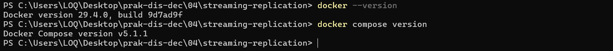

#### 2. Struktur folder
 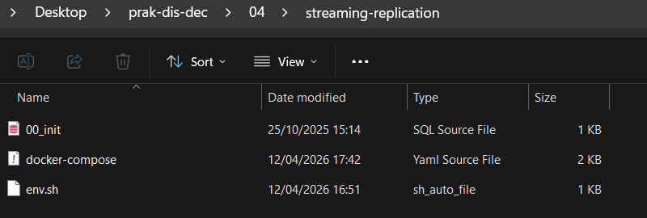
    1. 00_init.sql
     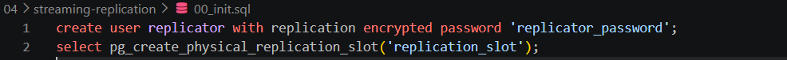
    2. docker-compose.yaml
     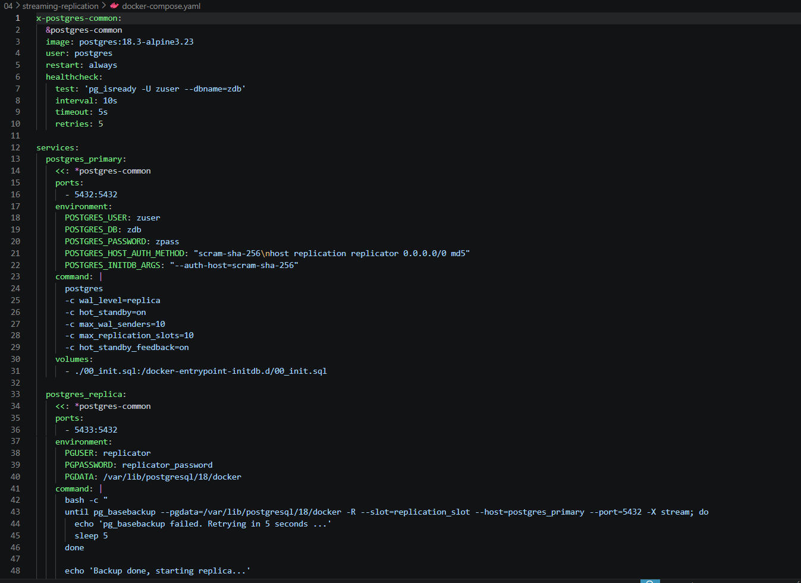
    3. env.sh
     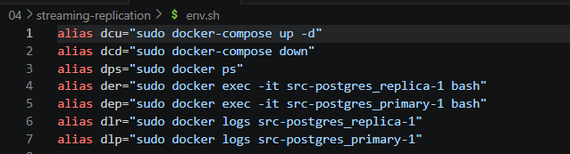

### 3. Menjalankan Docker-compose
 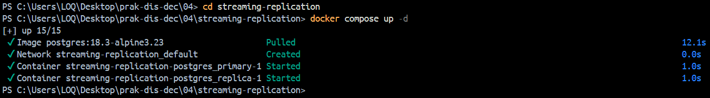

 Cek kedua image apakah berhasil diaktifkan 
 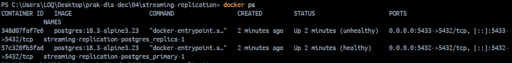

### 4. Pengujian
 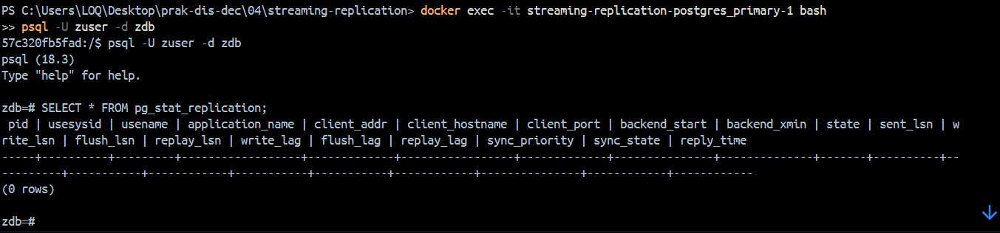

 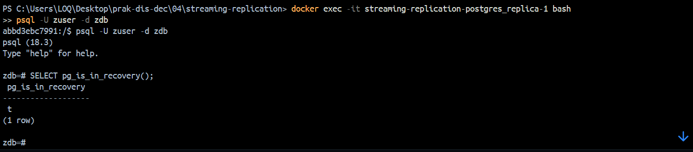

### Uji replikasi data
 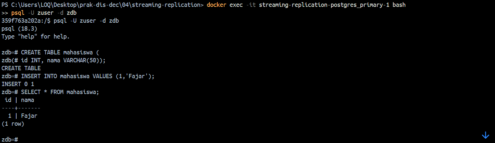

 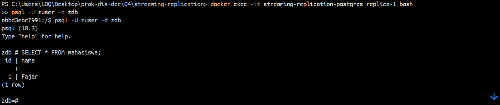

 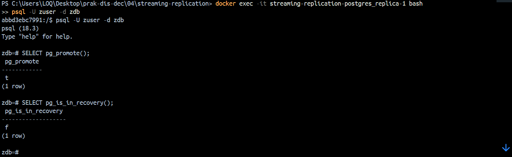

 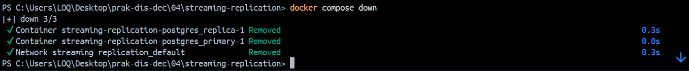

## Replikasi Master-Master Menggunakan Apache Ignite
### 1. Buat folder baru
 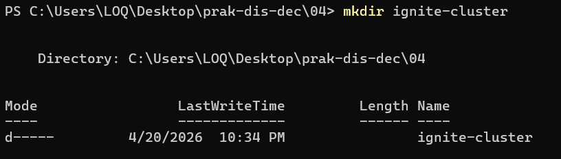

### 2. Buat file docker-compose
 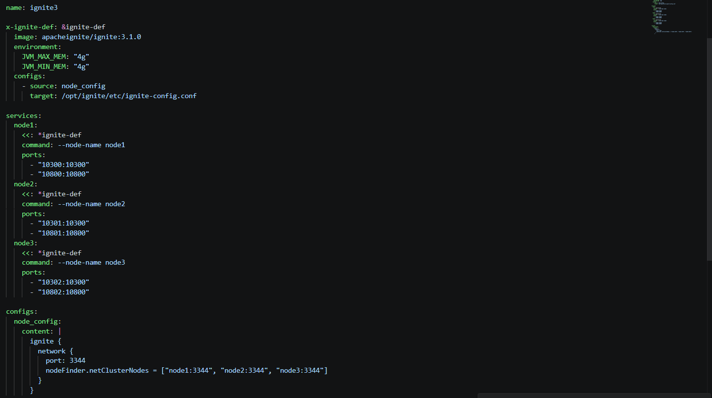

 ### 3. Jalankan node
 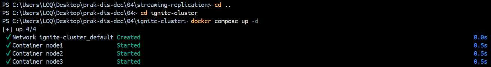

### 4. Cek node
 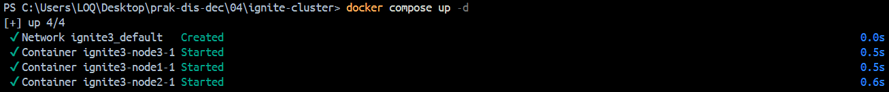

### 5. Jalankan CLI ignite
 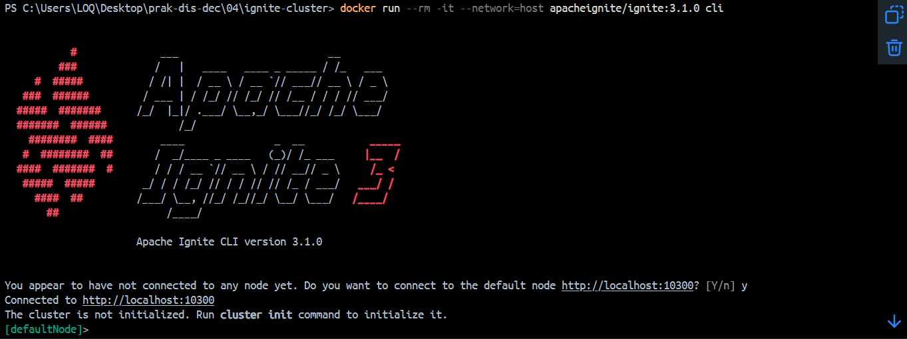

 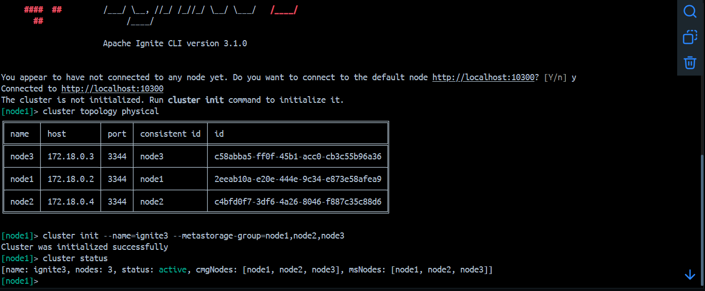

### Eksekusi perintah sql
Unduh dan eksrtak
 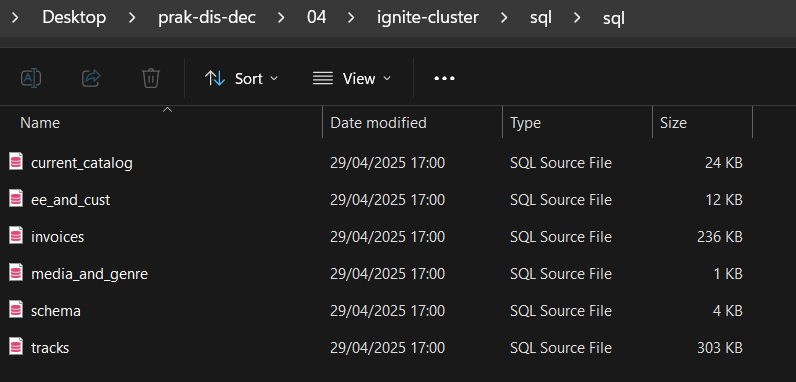

 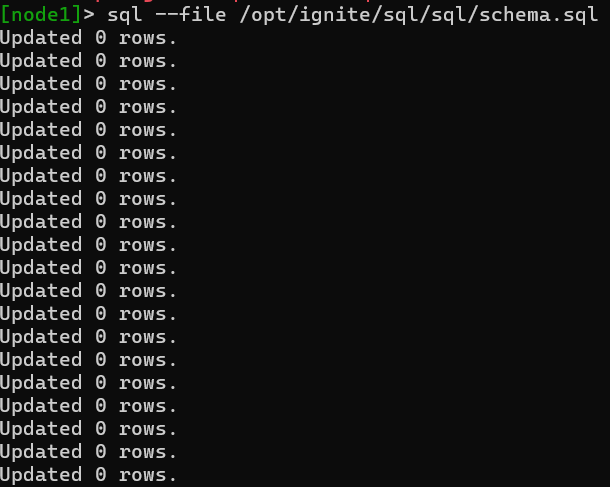

 ### Masuk ke mode sql
 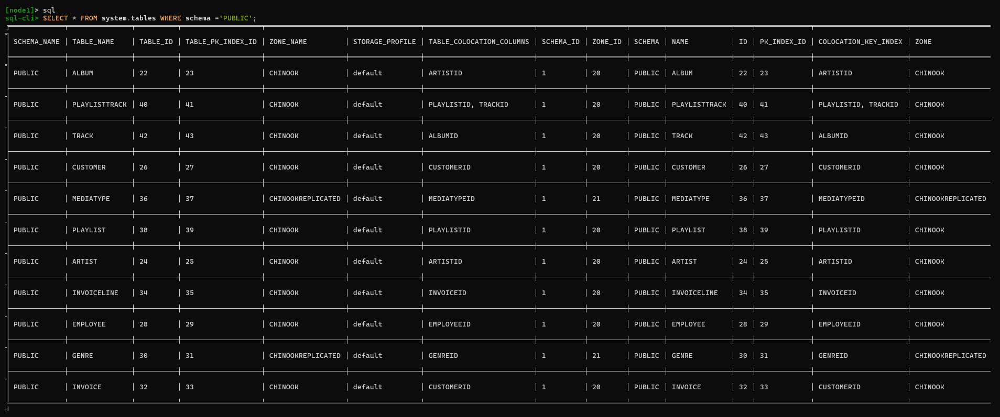

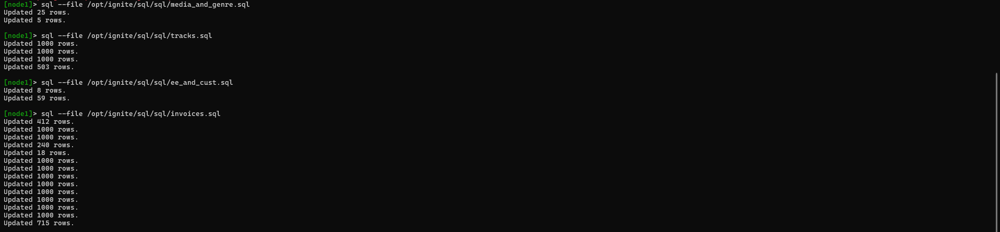

Untuk memeriksa apakah perubahan pada http://localhost:10300 tersebut telah dipropagasi ke node-node lainnya, kita bisa memeriksa dengan melakukan koneksi ke node-node lainnya. Berikut adalah node di http://localhost:10301:

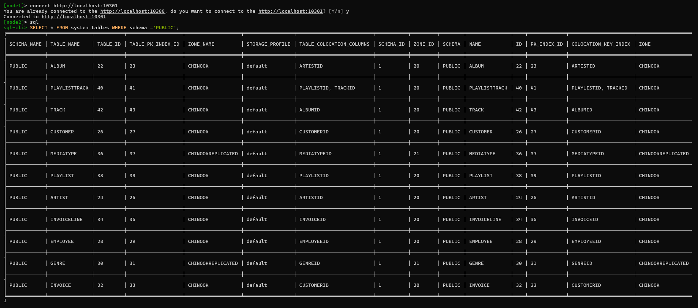

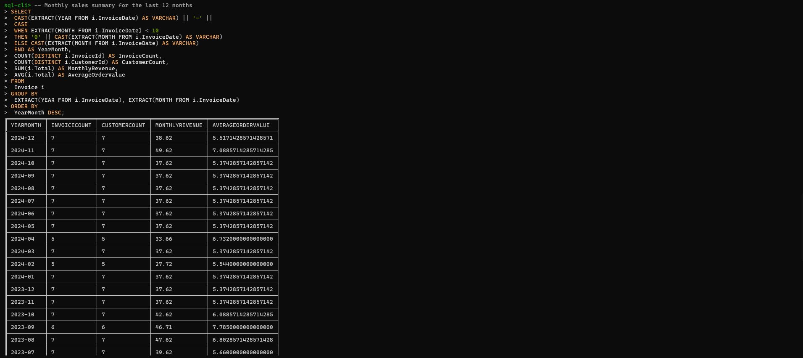

Memeriksa http://localhost:10302:

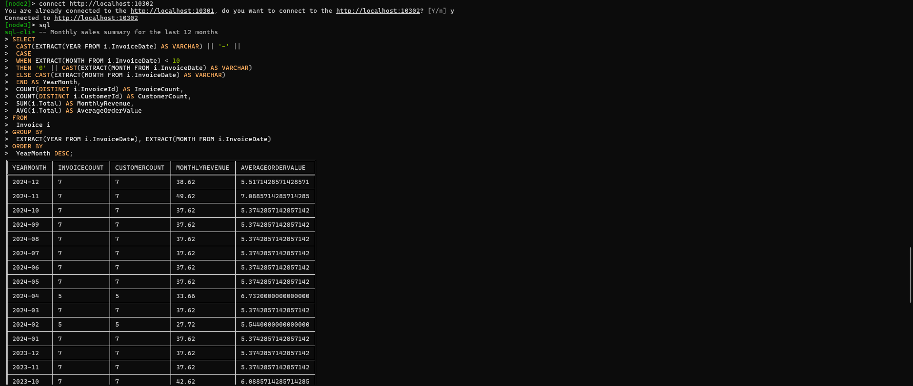

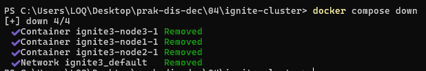