# Praktikum Minggu 5 - Fault Tolerance

Nama  : FAJAR TAUFIK ROMADHON

NIM   : 235410072

Kelas : IF-1

Mata Kuliah : PRAKTIKUM SISTEM TERDISTRIBUSI DAN TERDESENTRALISASI

## Pengantar 
## 4.1 Load Balancing Aplikasi 
Materi ini merupakan materi Praktikum SIstem Terdistribusi dan Terdesentralisasi untuk pembahasan tentang Fault Tolerance. Pembahasan tentang load balancing diperlukan agar high-availability dari suatu aplikasi bisa tercapai dengan melakukan proses scaling aplikasi menjadi lebih dari satu dan mengkonfigurasi proxy load balancer.

## Langkah langkah Praktikum: 
### 1. Persiapan 
Membuat folder workspace05
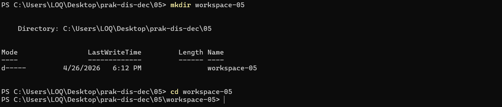

Untuk membuat aplikasi web menggunakan Blacksheep, install blacksheep dan blacksheep-cli terlebih dahulu:
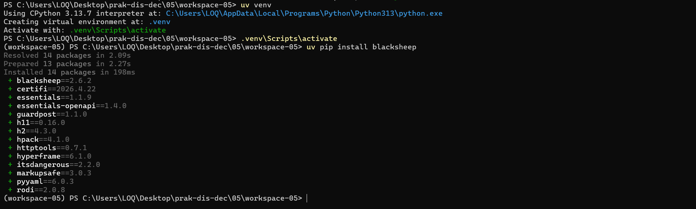
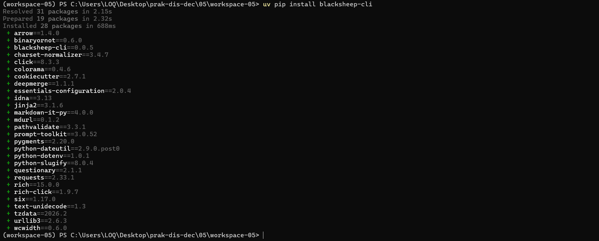

### 2. Pembuatan Aplikasi Web 
Buat aplikasi menggunakan cli : 
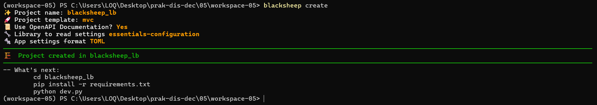

Install paket yang diperlukan : 
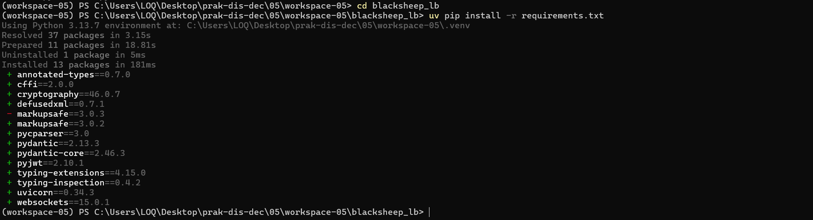

Pastikan bahwa aplikasi tersebut bisa berjalan dengan baik :
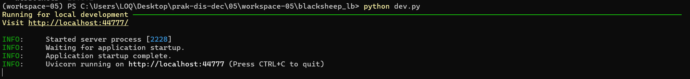

Akses ke http://localhost:44777 menggunakan browser :
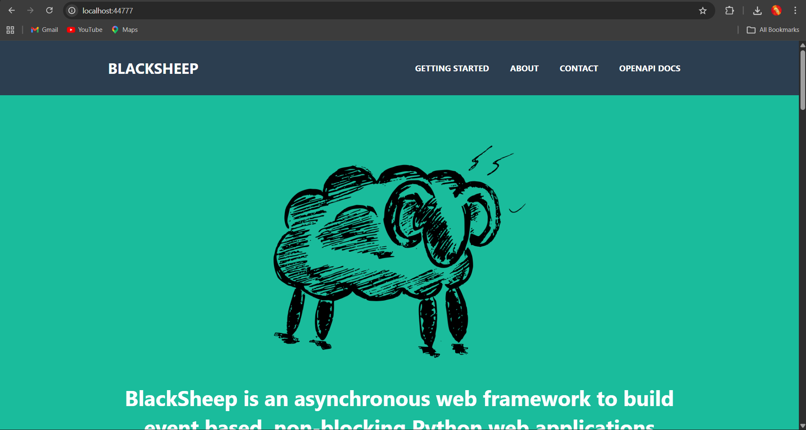

### 3. Siapkan Dockerfile dan docker-compose.yml
nginx/Dockerfile
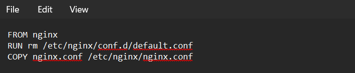

nginx/nginx.conf
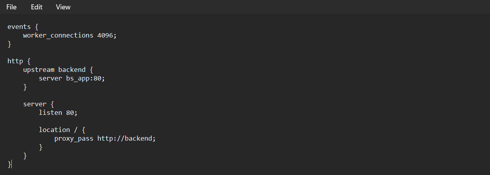

docker-compose.yml
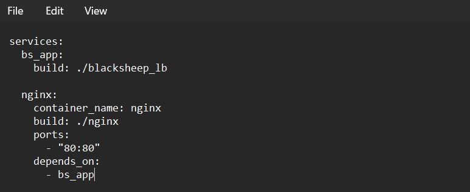

env.sh

docker-compose.yml

Membuat 
- bs_app-1
- bs_app-2
- nginx
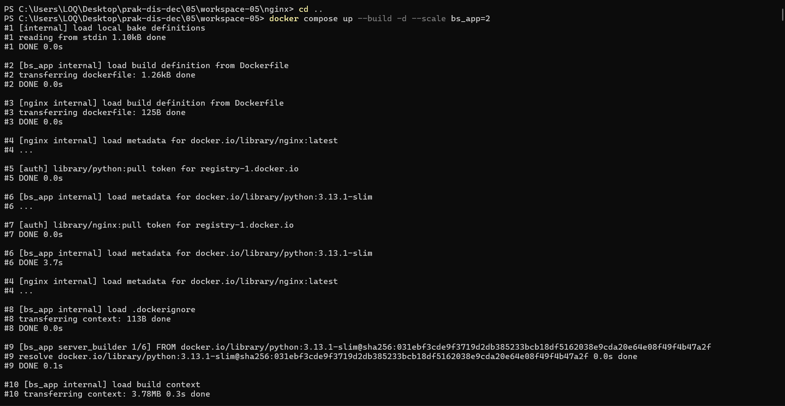
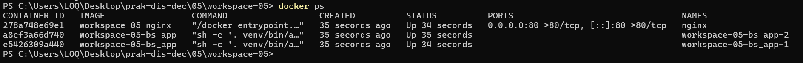

### 4. Jalankan Docker Compose
Untuk memeriksa, kita bisa melihat hasil di browser :
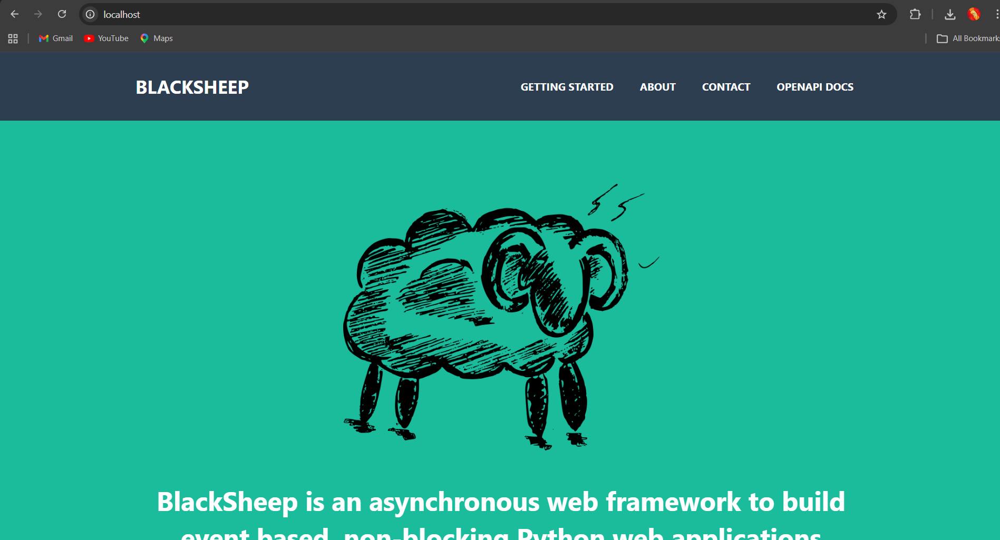
port yang digunakan sekarang port 80 (jika tidak menyebutkan port seperti tampilan di atas - hanya localhost, maka defaultnya 80), bukan 44777 lagi.

Akses ke aplikasi akan di-route melalui load balancer (nginx) ke salah satu instance. Lihat potongan log berikut:
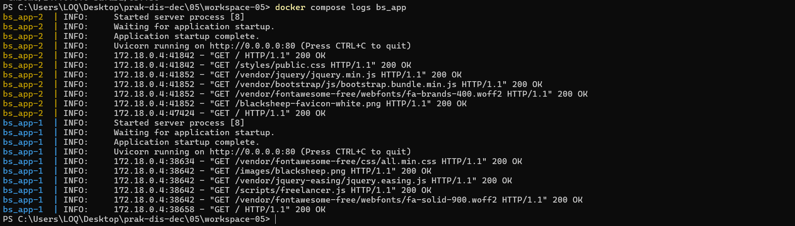
log untuk load-balancing-bs_app-1 mendapatkan 2 akses di bagian
paling bawah, sementara load-balancing-bs_app-2 mendapatkan 1 akses di bagian paling bawah. Ini berarti pada saat terdapat request, nginx me-route permintaaan / request tersebut ke load-balancing-bs_app-1.

Jika sudah selesai, matikan semua container:
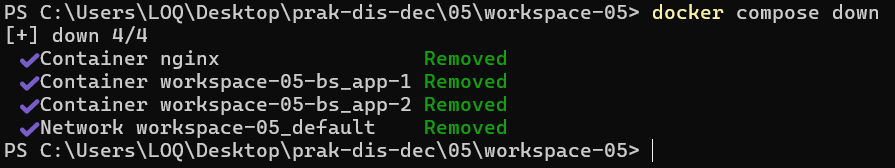

## 4.2 Failure Detection
Failure Detection adalah proses untuk menentukan apakah suatu komponen telah gagal.

### Heartbeat
Protokol heartbeat adalah protokol untuk memantau aktivitas suatu komponen. Jika suatu komponen pemantauan tidak menerima heartbeat dari komponen lain dalam jangka waktu tertentu, komponen tersebut diasumsikan telah gagal dan tidak responsif.

heartbeat/check-server.py
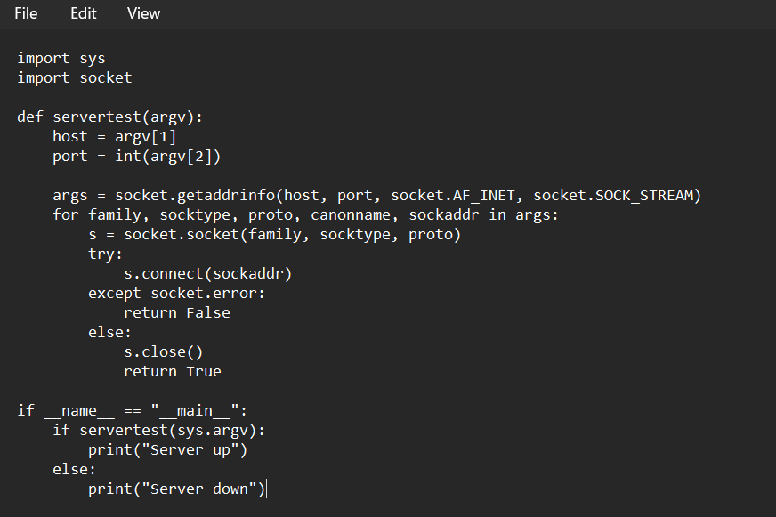

Jalankan pada kondisi blacksheep aktif
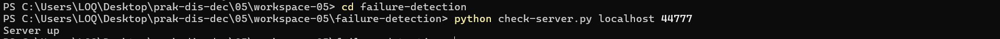

Jalankan pada kondisi blacksheep mati
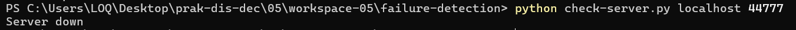

Metode heartbeat digunakan untuk mengecek apakah server aktif dengan mencoba membuka koneksi ke host dan port tertentu. Jika berhasil, server dianggap aktif.

failure-detection/check-retry.py
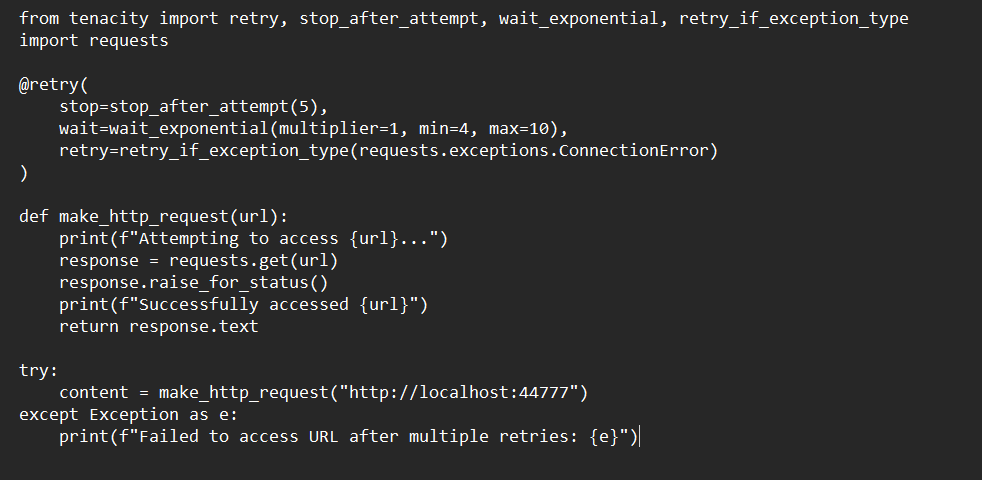

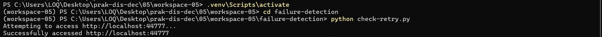
Retry digunakan untuk mencoba kembali koneksi ketika server gagal diakses. Sistem tidak langsung menyerah saat kegagalan pertama.

Coba script check-circuit-breaker.py pada 2 kondisi: aplikasi blacksheep aktif dan non-aktif setelah itu jelaskan cara kerja dari check-circuit-breaker.py.

check-circuit-breaker.py
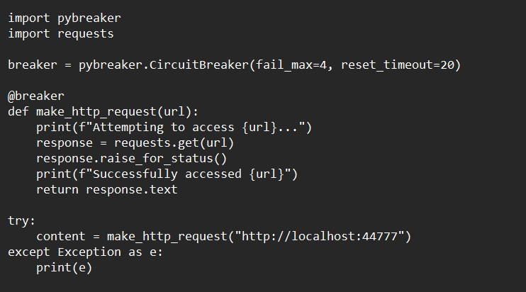

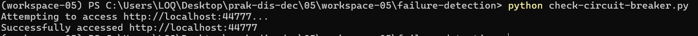

Circuit breaker digunakan untuk menghentikan sementara permintaan ke server ketika terjadi kegagalan berulang. Setelah server kembali normal, koneksi dapat dibuka kembali.