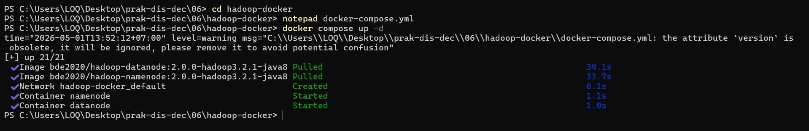
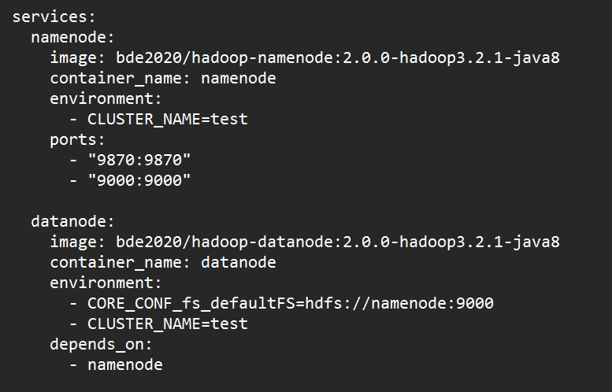
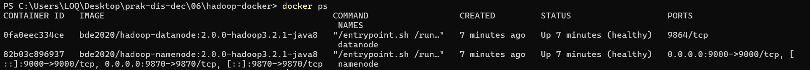
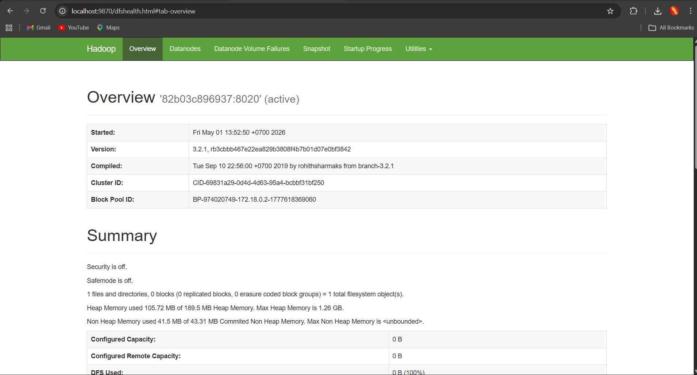
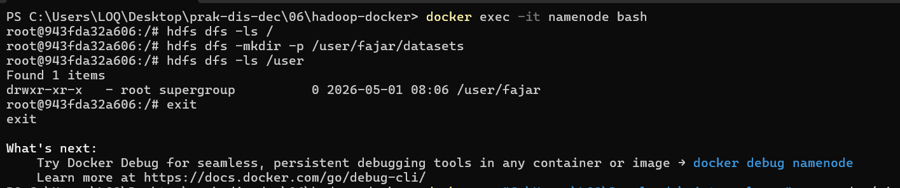
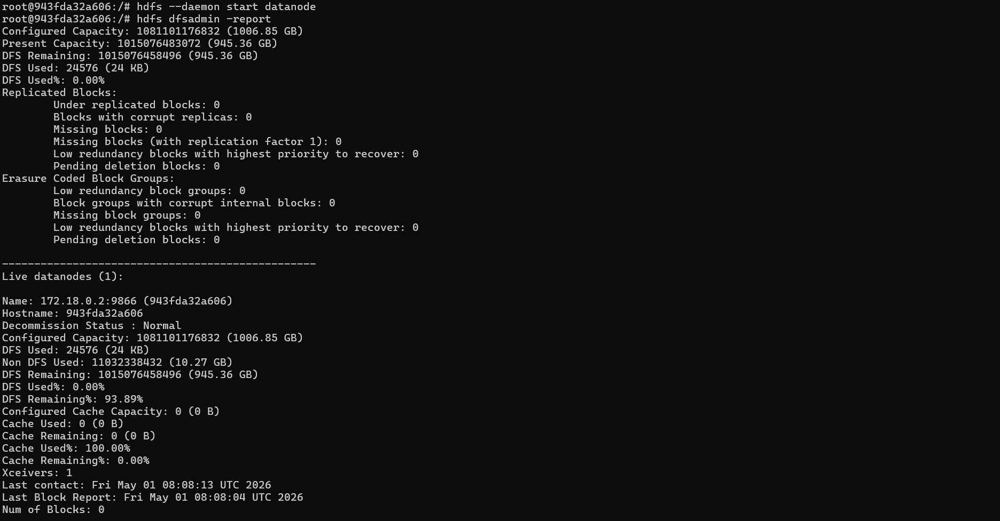
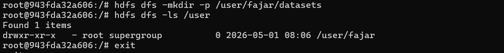
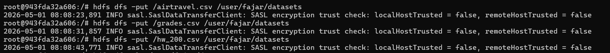
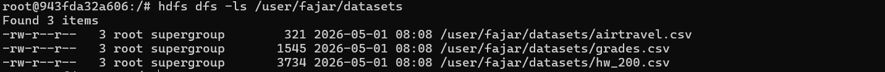

# Praktikum Minggu 6 - Distributed File System - HDFS

Nama  : FAJAR TAUFIK ROMADHON

NIM   : 235410072

Kelas : IF-1

Mata Kuliah : PRAKTIKUM SISTEM TERDISTRIBUSI DAN TERDESENTRALISASI

## Pengantar 
## 0. Persyaratan Software
Untuk mengerjakan materi pada petunjuk ini, beberapa distribusi software diperlukan:
- JDK: versi 17 dan/atau 21. Jika akan mengkompilasi Apache Hadoop, gunakan versi 17. JDK versi 17 digunakan untuk server, sedangkan untuk client bisa menggunakan JDK 17 atau 21.
- Apache Hadoop. Versi ini menggunakan versi 3.5.0 (rilis 2 April 2026).
- pdsh
- ssh
- sshd telah dijalankan. Pada sistem Artix Linux + dinit sebagai init system, jalankan menggunakan sudo dinitctl start sshd. Jika menggunakan systemd: sudo systemctl start ssh.

## Langkah langkah Praktikum: 
### 1. Unduh apache hdoop 
Saya memutuskan untuk menggunakan Docker karena di windows terdapat error yang tidak bisa saya fix. 

Membuat file docker-compose.yml dan menjalankan container:

### 2. Menjalankan container

### 3. Masuk ke Container 

### 4. Cek status HDFS

### 5. Membuat Direktori di HDFS

### 6. Upload Dataset ke HDFS

### 7. Melihat Isi Direktori

### Kesimpulan
Praktikum ini berhasil menunjukkan bagaimana Hadoop Distributed File System (HDFS) dapat dijalankan menggunakan Docker. Melalui proses konfigurasi dan pengujian, sistem yang terdiri dari NameNode dan DataNode dapat berjalan dengan baik sehingga memungkinkan penyimpanan data secara terdistribusi. Data berhasil diunggah ke dalam HDFS dan dapat diakses kembali melalui perintah yang tersedia, yang membuktikan bahwa mekanisme penyimpanan dan pengelolaan data telah berfungsi dengan benar. Selain itu, praktikum ini juga memberikan pemahaman mengenai pentingnya peran setiap komponen dalam HDFS, seperti NameNode sebagai pengelola metadata dan DataNode sebagai penyimpan data.