# Praktikum Minggu 7 - Cloud Computing

Nama  : FAJAR TAUFIK ROMADHON

NIM   : 235410072

Kelas : IF-1

Mata Kuliah : PRAKTIKUM SISTEM TERDISTRIBUSI DAN TERDESENTRALISASI

## 0. Pengantar 
Cloud Computing menggunakan pendekatan XaaS atau sering juga disebut sebagai Everything as a Service. Dengan menggunakan pendekatan ini, provider dari Cloud Computing menyediakan berbagai sumber daya komputasi dan konsumen mendapatkan sumber daya tersebut dalam bentuk layanan. Meskipun saat ini ada banyak XaaS tetapi
secara umum biasanya dibagi menjadi 3:
1. SaaS: Software as a Service
2. PaaS: Platform as a Service
3. IaaS: Infrastructure as a Service
## Tugas 0
1. Carilah berbagai contoh vendor/komunitas SaaS, PaaS, dan IaaS masing-masing 1 saja.

    | Jenis | Vendor | Service |
    |---|---|---|
    | SaaS | Google Docs | Pengolah dokumen online |
    | PaaS | Heroku | Platform deploy aplikasi |
    | IaaS | AWS EC2 | Virtual machine cloud |

2. Uraikan apa yang menjadi service dari berbagai vendor untuk berbagai kategori XaaS tersebut.

    SaaS (Software as a Service)
    Pengguna langsung memakai software melalui internet tanpa instalasi lokal.
    Contoh:
    - Google Docs
    - Gmail
    - Canva

    PaaS (Platform as a Service)
    Provider menyediakan platform untuk development dan deployment aplikasi.
    Contoh:
    - Heroku
    - Railway
    - Render

    IaaS (Infrastructure as a Service)
    Provider menyediakan infrastruktur seperti server, storage, dan networking.
    Contoh:
    - AWS EC2
    - Google Compute Engine
    - DigitalOcean

3. Jelaskan secara umum arsitektur dari XaaS tersebut dalam bentuk visualisasi gambar.

    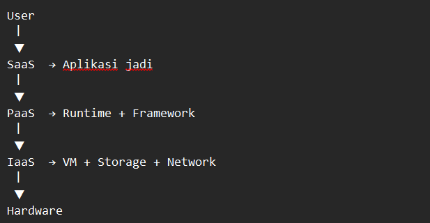

## 1. Clone Source Code Flask
Clone Repository Flask
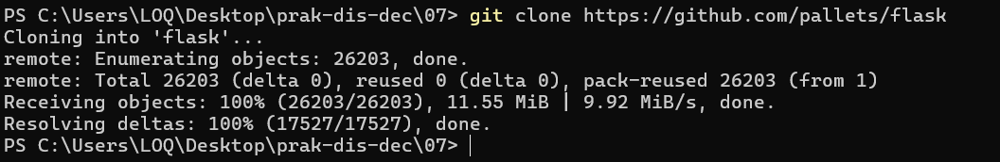

Copy folder tutorial
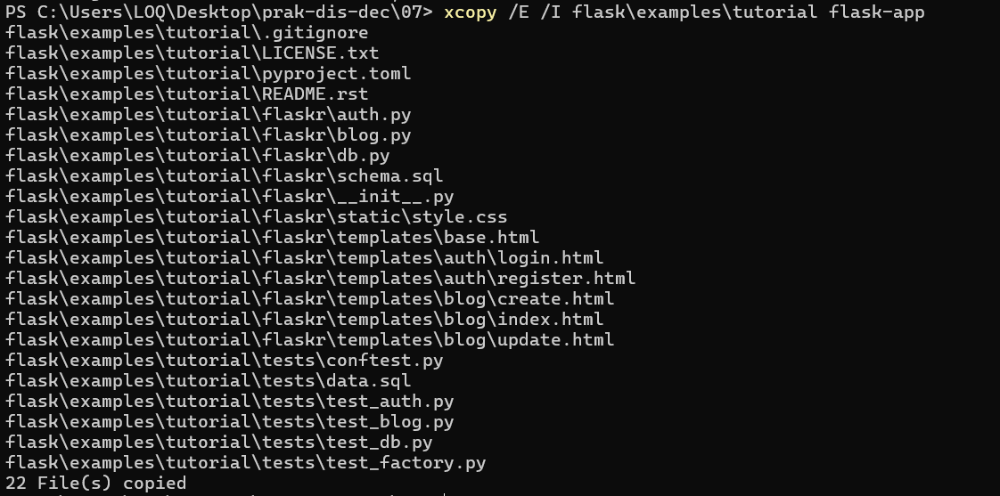

Masuk ke project
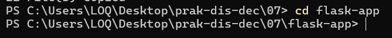

## 2. Membuat Environment Python
Buat virtual environment
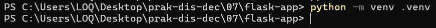

Aktifkan environment
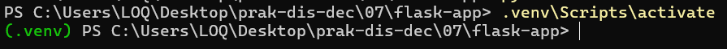

## 3. Install Paket yang Diperlukan
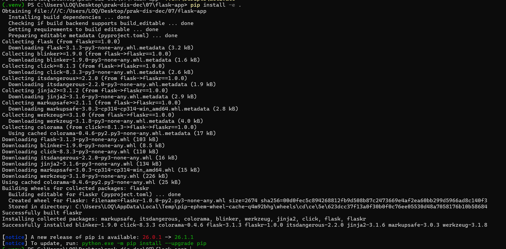

## 4. Jalankan Flask Lokal
Inisialisasi database
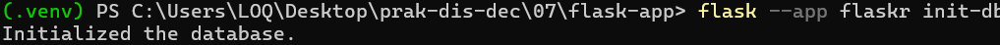

Jalankan aplikasi
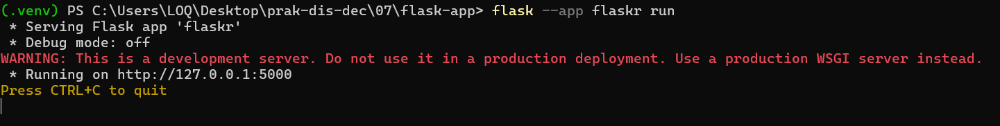

Cek di browser
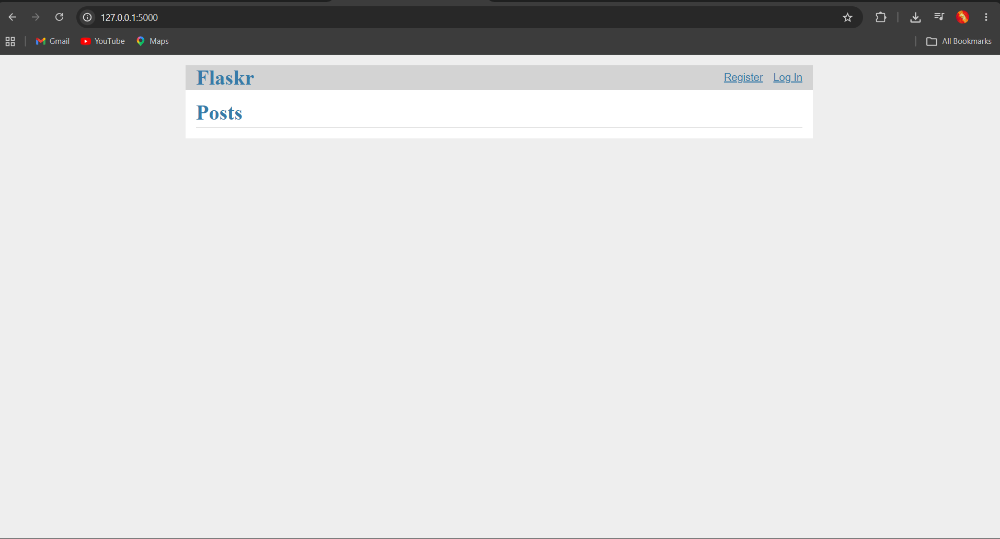

## 5. Membuat Containerized App (Docker)
Buat Dockerfile
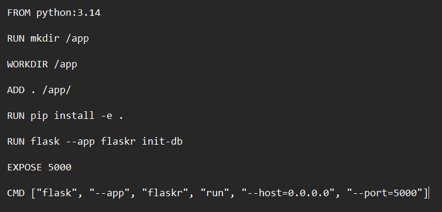

Build Docker Image
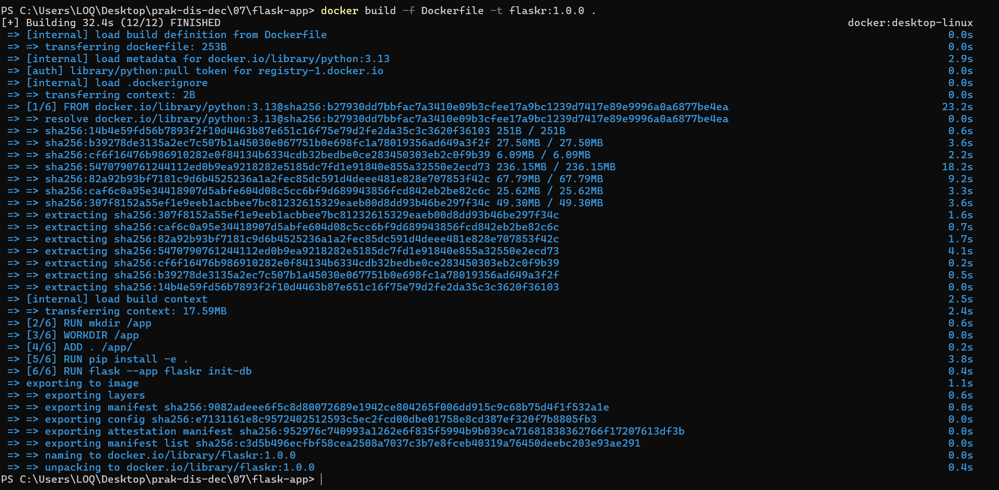

Cek Image
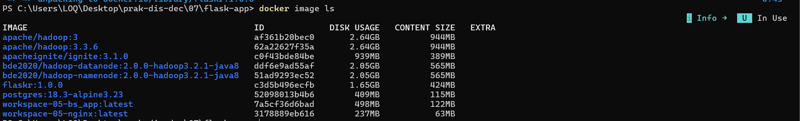

## 6. Menjalankan Image
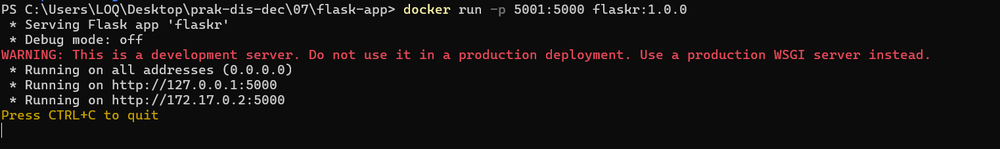

Akses di browser
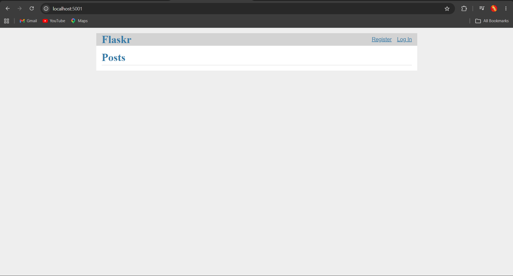