# Praktikum Minggu 8 - Arsitektur Microservices untuk Sistem Terdistribusi

Nama  : FAJAR TAUFIK ROMADHON

NIM   : 235410072

Kelas : IF-1

Mata Kuliah : PRAKTIKUM SISTEM TERDISTRIBUSI DAN TERDESENTRALISASI

## 0. Pengantar 
Microservices adalah salah satu arsitektur yang banyak digunakan pada sistem terdistribusi. Dengan menggunakan arsitektur ini, software terdiri atas frontend yang berisi UI/UX dan merupakan titik interaksi antara pengguna dengan aplikasi. Sisi frontend tersebut kemudian meminta layanan / services dari backend yang berupa service. Untuk saat ini, kebanyakan service tersebut bisa dibuat menggunakan REST API, GraphQL, dan gRPC. Praktik pada mata kuliah ini akan menggunakan REST API dengan pustaka FastAPI dan SQLModel untuk ORM dari Python.

## 1. Persyaratan
1. Cek apakah uv sudah terinstall
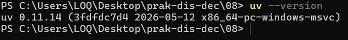

2. Membuat Virtual environment
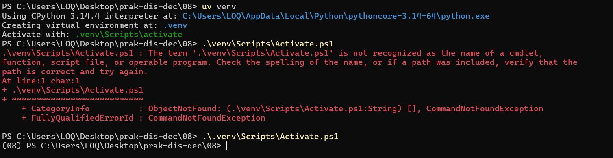

3. Instalasi Paket FastAPI dan SQLModel
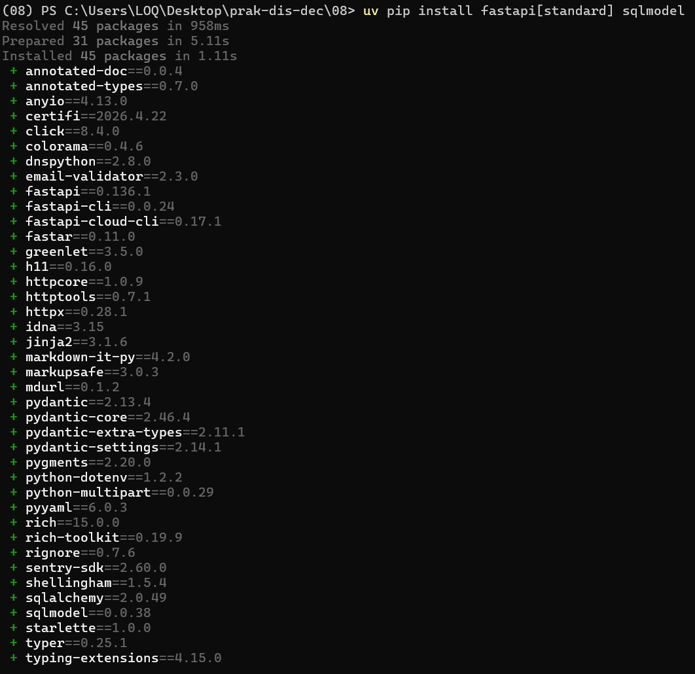

4. Masuk ke SQLlite
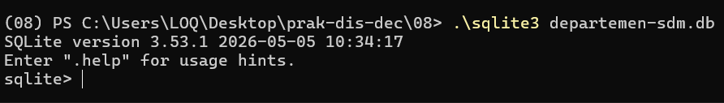

5. Buat database
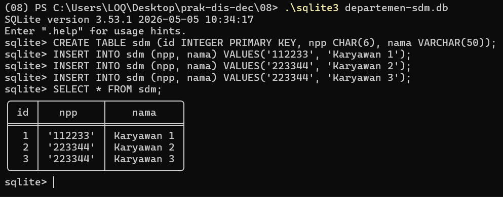

## 2. Source Code
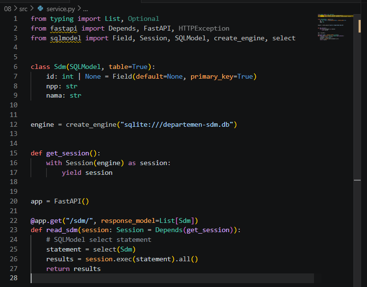

## 3. Menjalankan Source Code
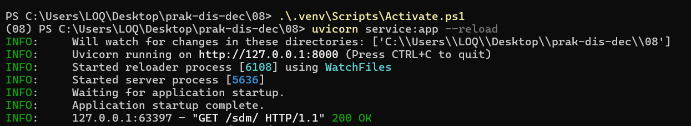

Untuk memeriksa, akses dari browser atau dari headless tool (curl atau wget):
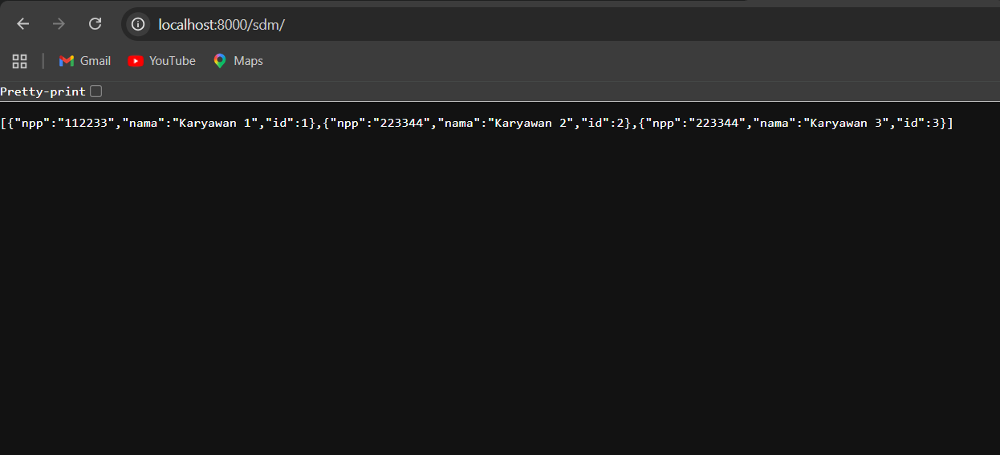

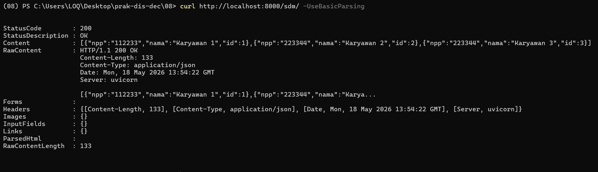

## 4. Tugas
1. Buat satu tabel baru menggunakan SQLite, tabel berbeda dari yang ada pada contoh. Tabel tersebut mempunyai 1 primary key dan setidaknya berisi data dengan tipe INT, CHAR, VARCHAR, BOOLEAN, dan FLOAT.
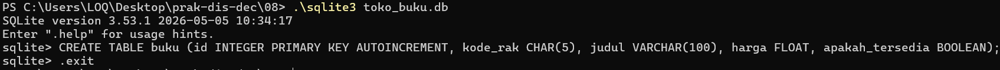

2. Isikan 5 data menggunakan script Python
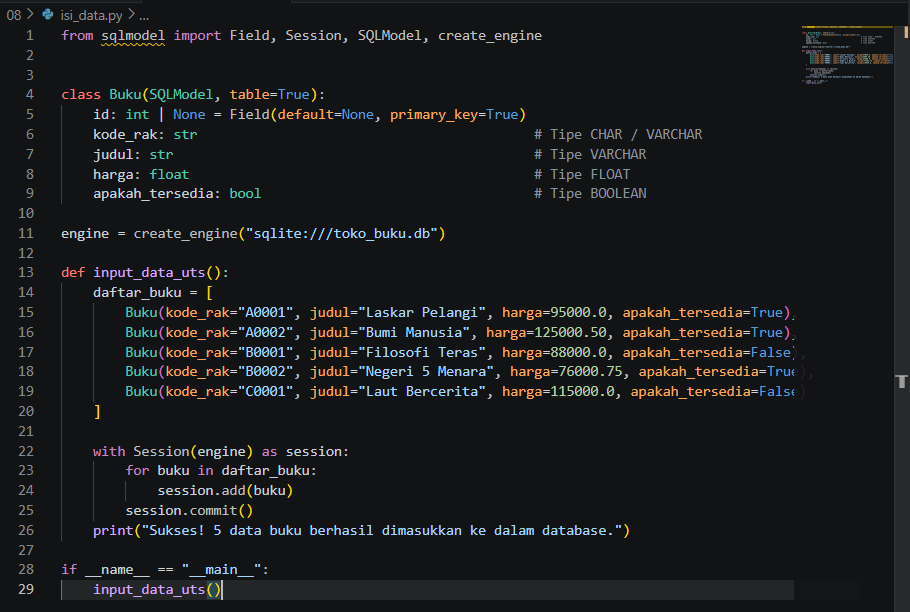
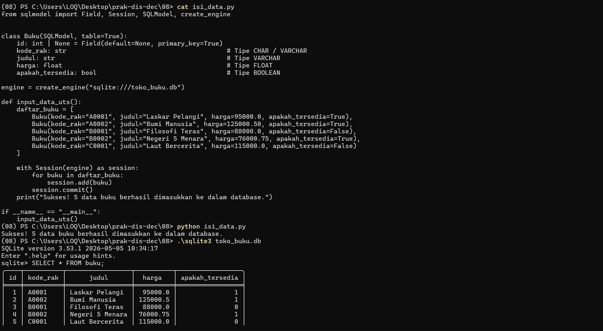

3. Buat RESTful API endpoint untuk menampilkan semua data yang telah diisikan.
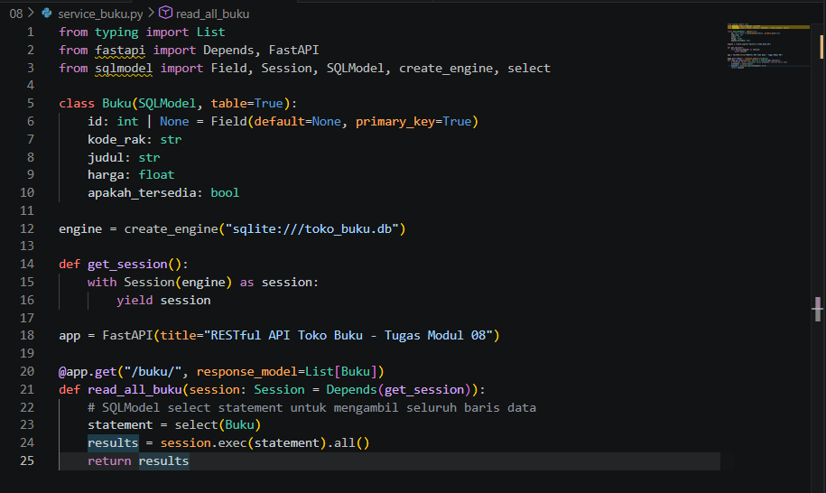
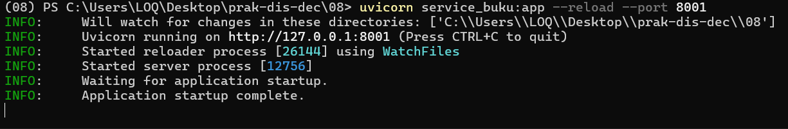

4. Tampilkan hasil RESTful API endpoint tersebut menggunakan curl.
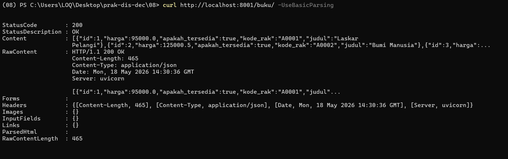