# Praktikum Minggu 9 - Arsitektur Microservices untuk Sistem Terdistribusi : GraphQL dan gRPC

Nama  : FAJAR TAUFIK ROMADHON

NIM   : 235410072

Kelas : IF-1

Mata Kuliah : PRAKTIKUM SISTEM TERDISTRIBUSI DAN TERDESENTRALISASI

## 0. Pengantar 
Microservices adalah salah satu arsitektur yang banyak digunakan pada sistem terdistribusi. Dengan menggunakan arsitektur ini, software terdiri atas frontend yang berisi UI/UX dan merupakan titik interaksi antara pengguna dengan aplikasi. Sisi frontend tersebut kemudian meminta layanan / services dari backend yang berupa service. Untuk saat ini, kebanyakan service tersebut bisa dibuat menggunakan REST API, GraphQL, dan gRPC. Praktik pada mata kuliah ini akan menggunakan GraphQL dan gRPC.

## 1. GraphQL
GraphQL adalah spesifikasi query language untuk API di sisi server dan melibatkan mekanisme query khusus dari client ke server tersebut. Jika pernah menggunakan RESTful API, GraphQL mempunya kemiripan cara kerja, perbedaannya terletak pada cara melakukan query. 

## 1.1. GraphQL Server
Untuk membangun server GraphQL di Python, kita bisa menggunakan salah satu pustaka di Python, yaitu Strawberry (https://strawberry.rocks/). Berikut adalah source code untuk server:
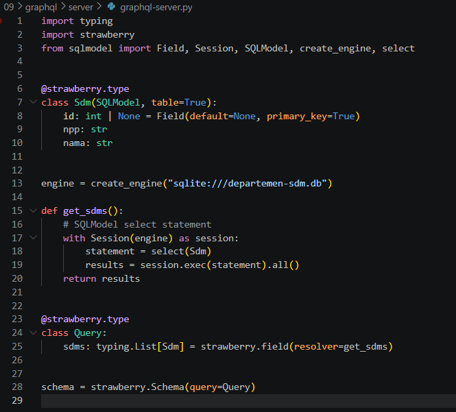

Untuk menjalankan:

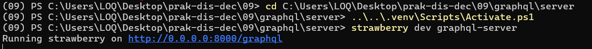

Untuk menguji, kita bisa mengakses GraphQL Explorer dengan menggunakan browser pada URL http://localhost:8000/graphql (lihat di atas):

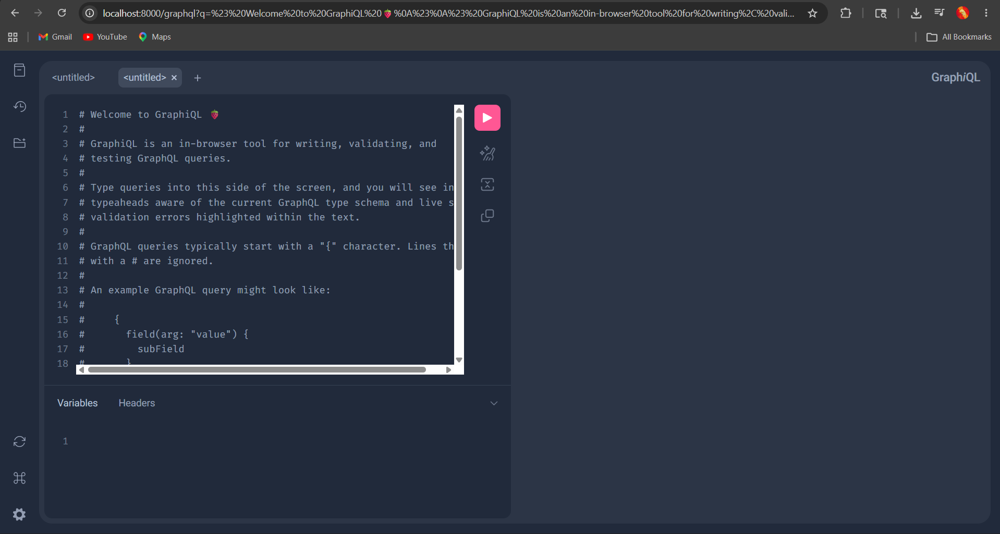

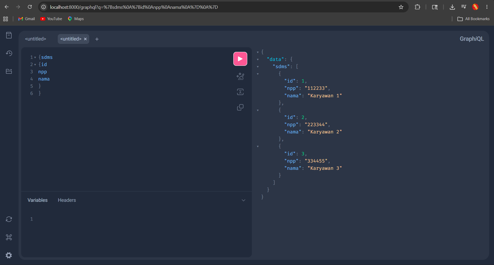

## 1.2. GraphQL Client
Selain menggunakan GraphQL Explorer, developer juga bisa menggunakan script / source code untuk mengakses data yang ada pada server tersebut. Untuk keperluan tersebut, digunakan pustaka GraphQL client. Pustaka yang digunakan di sini adalah gql (https://github.com graphql-python/gql). Install dengan menggunakan requirements.txt. Source code:
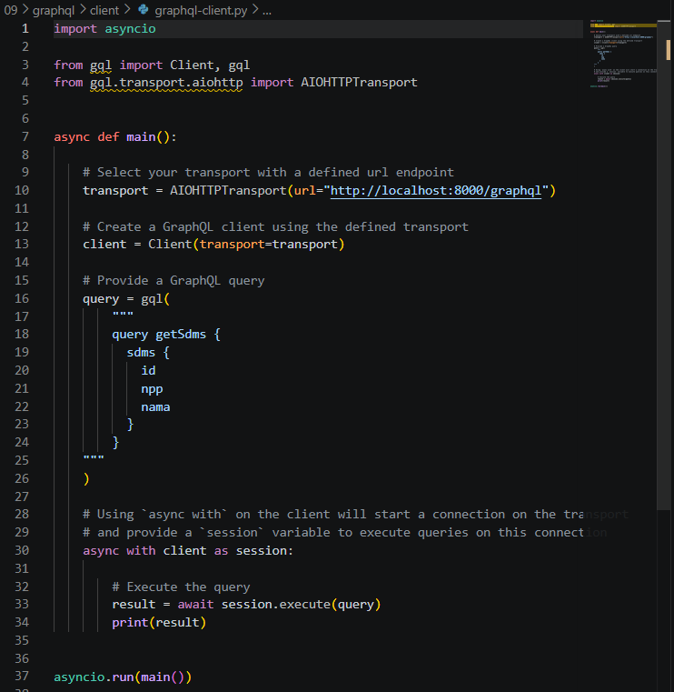
Jalankan dengan cara sebagai berikut:
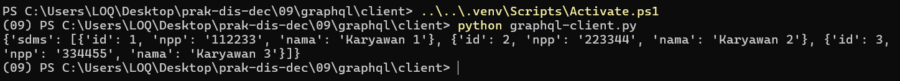

## 2. gRPC
gRPC (singkatan dari gRPC Remote Procedure Calls) merupakan mekanisme dan spesifikasi untuk komunikasi antara 2 node / komputer dengan menggunakan protocol buffers sebagai serialisasi data antara 2 node tersebut. 

Secara umum, baik untuk client maupun server, langkah awal yang dilakukan meliputi definisi dan kompilasi file proto (serialisasi menggunakan protocol buffers). Kompilasi ini akan membentuk stub yang akan digunakan dalam request - response. Perlu diketahui, proto dan hasil kompilasi untuk server maupun client harus sama. Untuk keperluan praktikum ini, berikut adalah file service.proto:
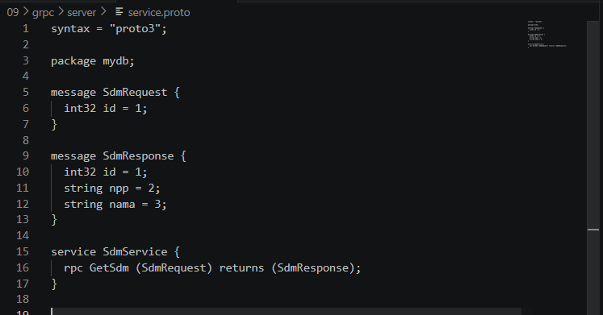
Kompilasi service.proto tersebut (perhatikan ada titik yang berarti current directory):
Hasilnya adalah 2 file sebagai berikut:
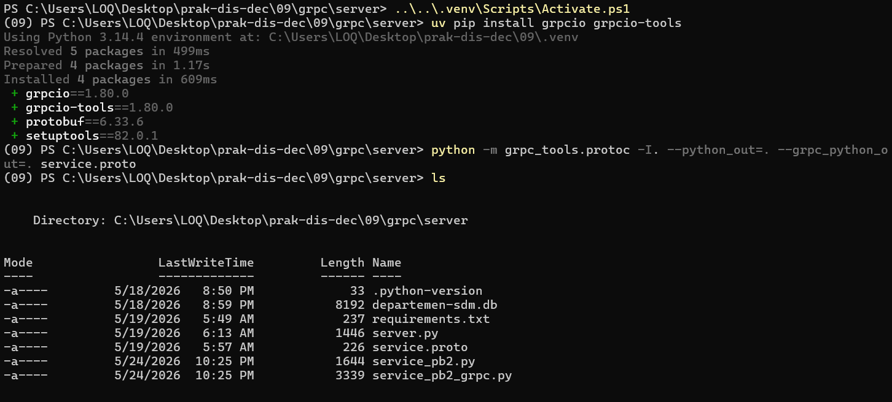
service_pb2.py dan service_pb2_grpc.py

## 2.1. gRPC Server
Untuk gRPC server ini, request akan dilakukan untuk meminta satu data berdasarkan id tertentu. Jika akan membuat response yang memungkinkan memberikan seluruh data, maka service proto harus menggunakan … repeated …

Source code untuk mengakses data di SQLite dan kemudian menserialisasikan hasilnya ke dalam protocol buffers untuk diakses oleh gRPC client adalah sebagai berikut:
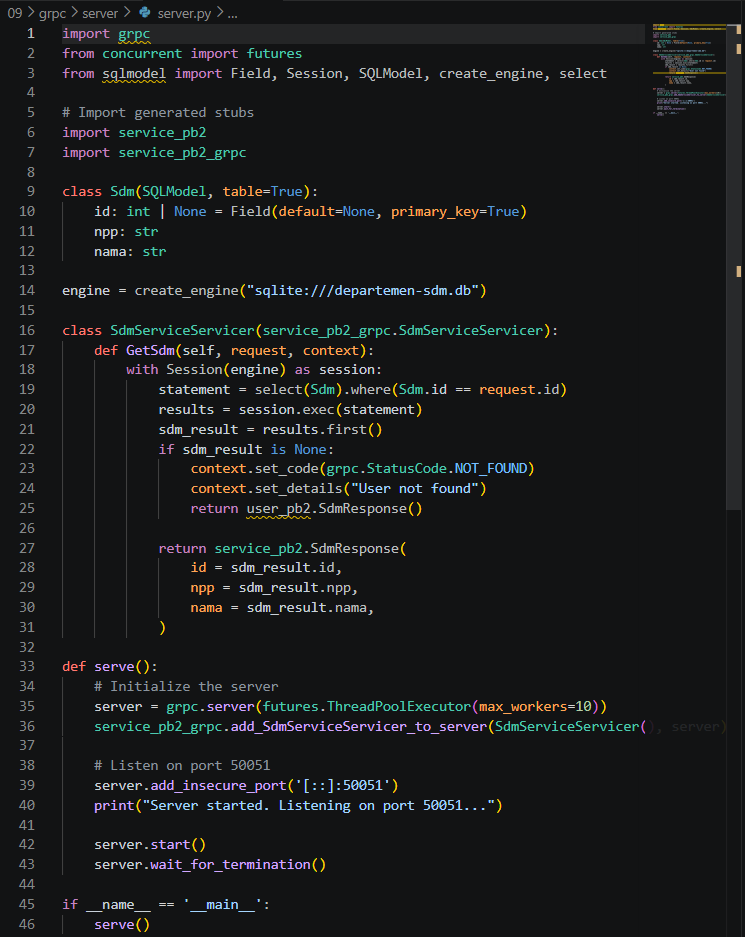
Jalankan dengan perintah berikut:
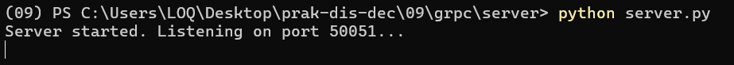

## 2.2. gRPC Client
Source code untuk mengirimkan request untuk mengambil data SDM dengan id tertentu adalah sebagai berikut:
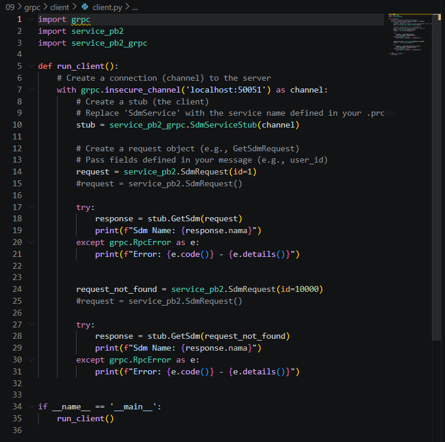
Pada source code tersebut, kita mengirimkan 2 requests: 1 untuk request dengan id yang benar-benar ada (1) dan 1 untuk request dengan id yang benar-benar tidak ada (10000). Jika dijalankan, hasilnya:
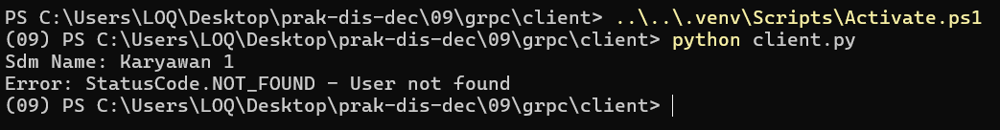

## TUGAS
1. Dengan menggunakan file SQLite pada tugas kemarin (tabel yang mempunyai 1 primary key dan setidaknya berisi data dengan tipe INT, CHAR, VARCHAR, BOOLEAN, dan FLOAT), buat GraphQL endpoint untuk tabel tersebut dan berikan contoh akses client untuk mengambil semua data.
Membuat GraphQL Server (tugas_graphql_server.py)
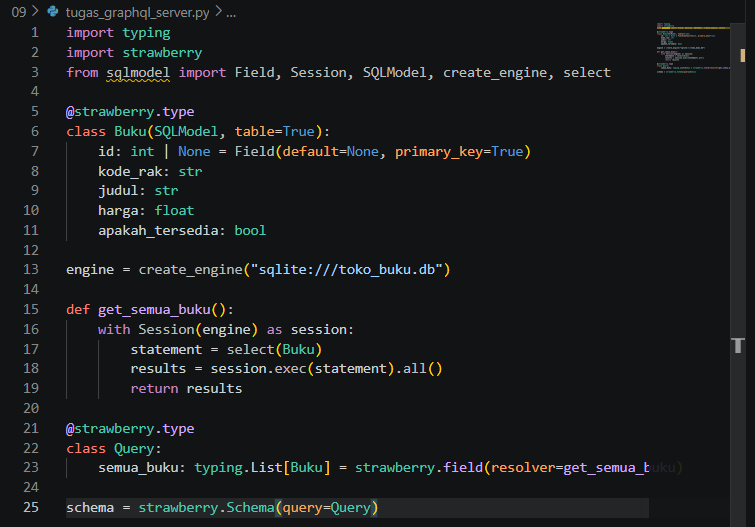

Jalankan Server GraphQL Tugas
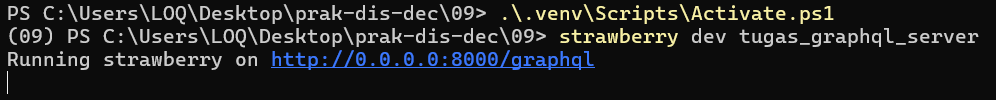

Membuat GraphQL Client (tugas_graphql_client.py)
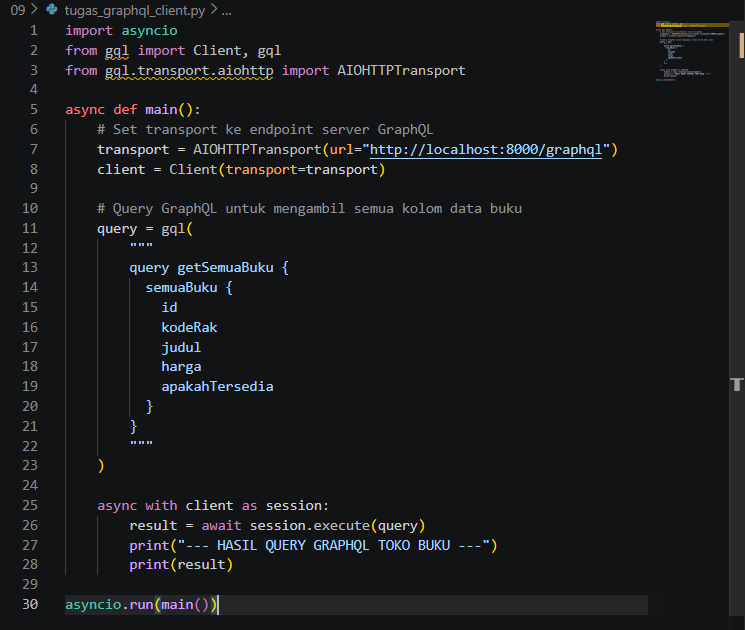

Jalankan Client Tugas
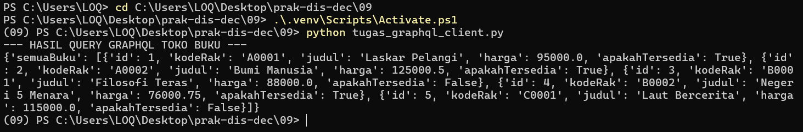

2. Dengan menggunakan file SQLite pada tugas kemarin (tabel yang mempunyai 1 primary key dan setidaknya berisi data dengan tipe INT, CHAR, VARCHAR, BOOLEAN, dan FLOAT), buat service.proto untuk semua data tersebut, kompilasi, buat gRPC servernya dan kemudian berikan contoh gRPC client untuk mengambil salah satu data.

Membuat File Protokol (tugas_buku.proto)
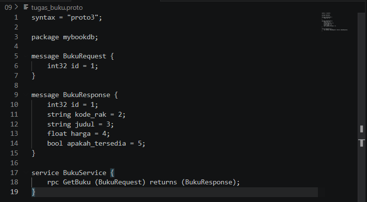

Mengompilasi File Proto
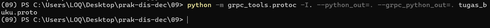

Membuat Server gRPC (tugas_grpc_server.py)
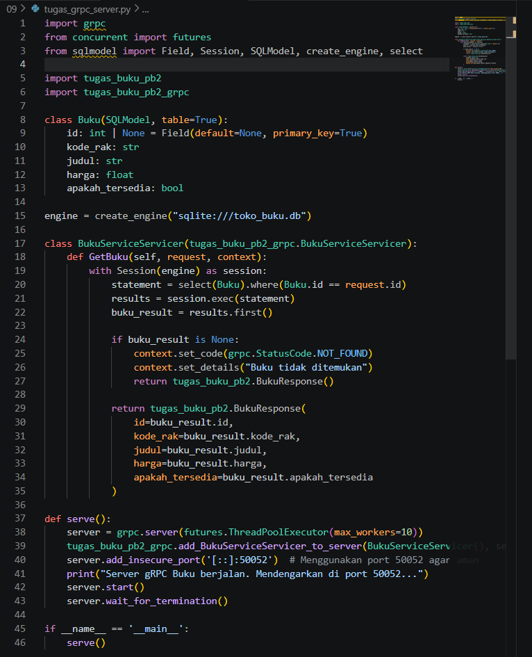

Jalankan server gRPC
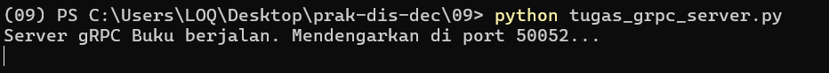

Membuat Client gRPC (tugas_grpc_client.py)
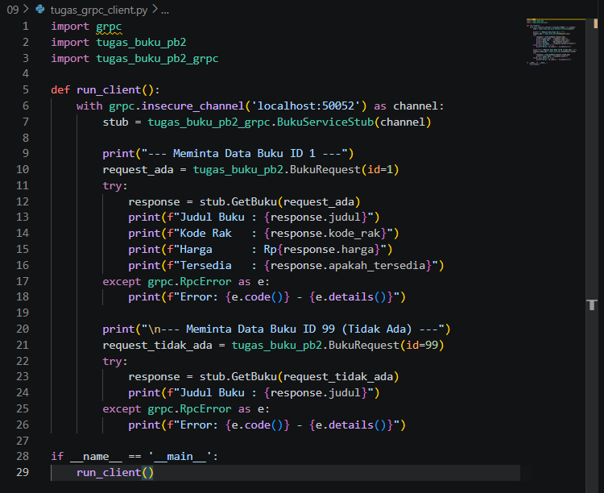

jalankan client gRPC:
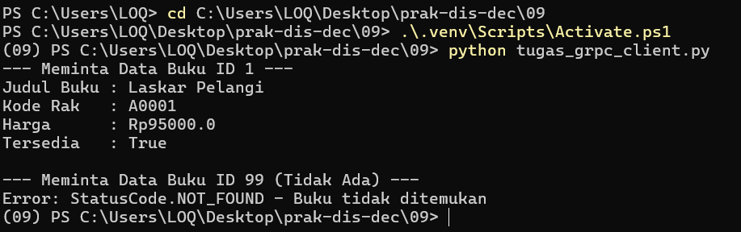