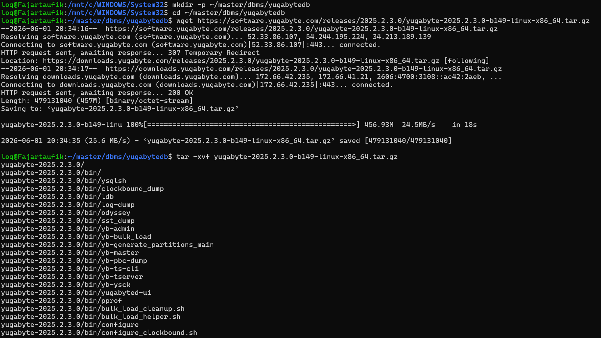
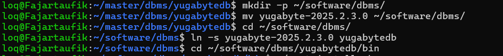
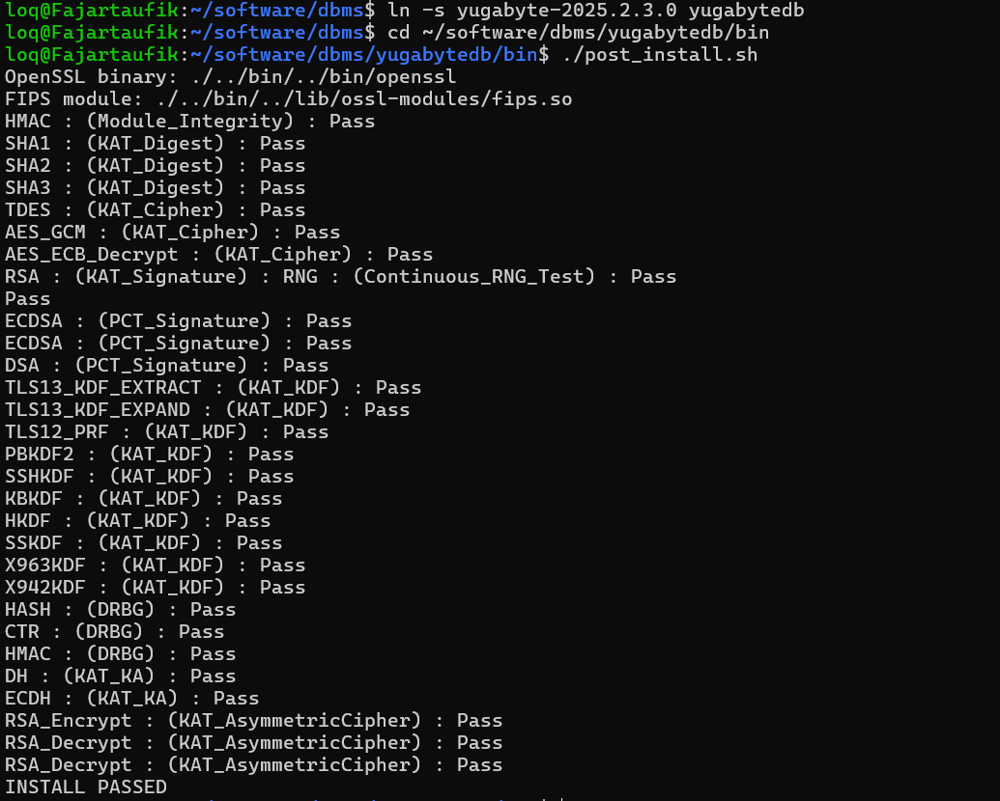
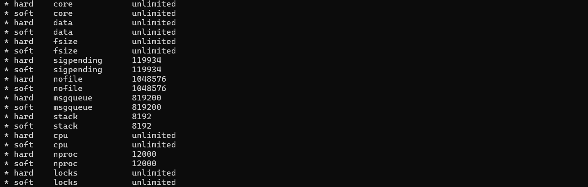
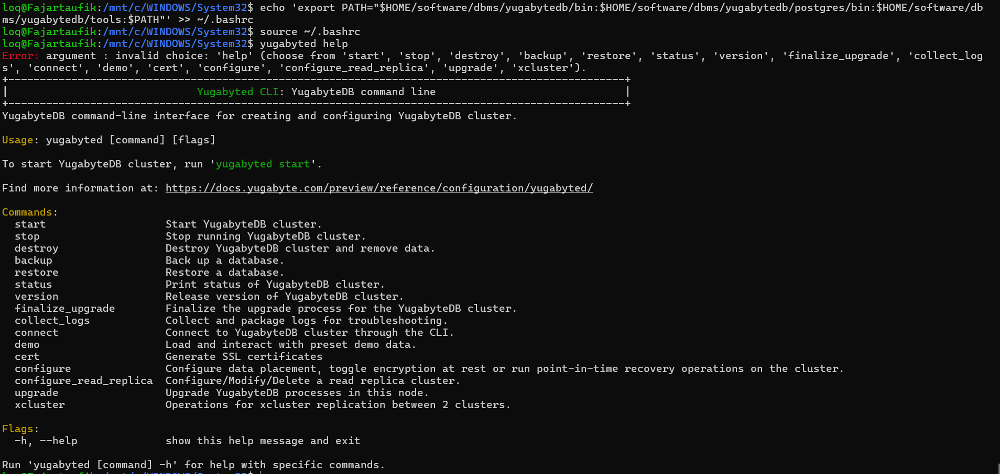
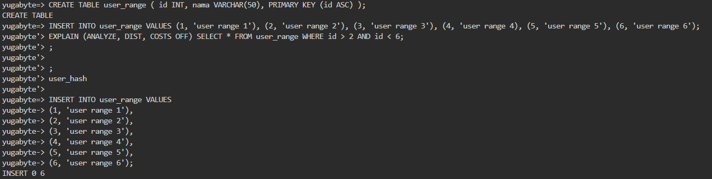
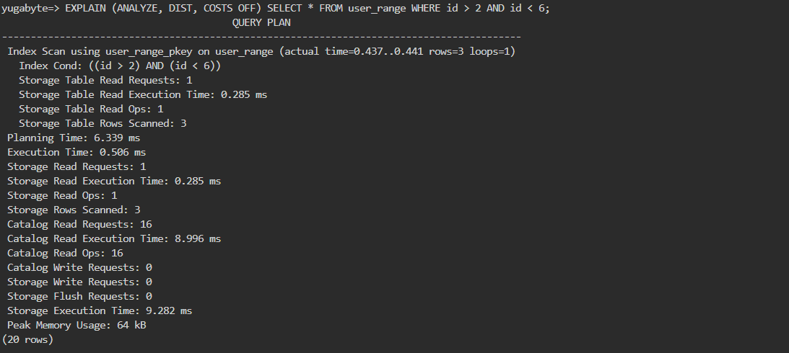
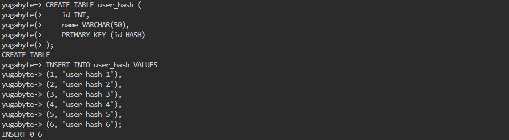
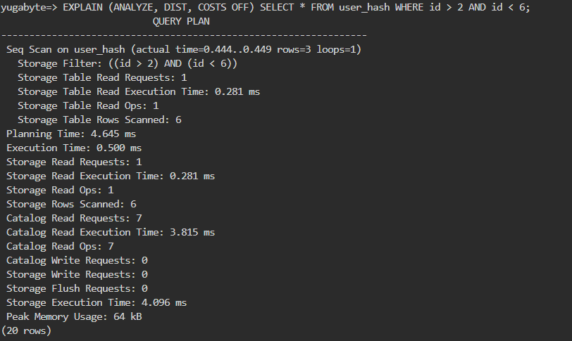
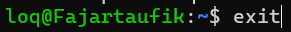

# Praktikum Minggu 10 - Data Terdistribusi

Nama  : FAJAR TAUFIK ROMADHON

NIM   : 235410072

Kelas : IF-1

Mata Kuliah : PRAKTIKUM SISTEM TERDISTRIBUSI DAN TERDESENTRALISASI

## 0. Pengantar 
Materi ini merupakan materi praktikum Sistem Terdistribusi dan Terdesentralisasi untuk pembahasan tentang Data Terdistribusi. Data terdistribusi merupakan salah satu strategi yang banyak digunakan untuk mengelola skalabilitas dan high availability dari data. Pada materi ini, digunakan YugabyteDB untuk memberikan contoh nyata. Untuk mengerjakan materi ini, gunakan Linux (baik Linux sebagai sistem operasi utama maupun Linux di WSL pada sistem operasi Windows). Materi ini hanya merupakan materi awal dan hanya digunakan untuk mendapatkan
gambaran dari data terdistribusi. Adapun pengelolaan di industri akan lebih kompleks lagi (melibatkan application sharding, sharded database, maupun distributed database deployment). Metode serta arsitektur bervariasi dan pemilihannya tergantung situasi serta kondisi di lapangan.

## 1. Instalasi
Untuk instalasi, ekstraksi hasil unduhan tersebut kemudian letakkan pada
subdirektori tertentu, buat symlink (jika diperlukan), buat file untuk env variables. Setelah itu, setiap akan mengaktifkan YugabyteDB pada setiap shell, source file env variables tersebut.
Ekstraksi

Pindahkan ke Subdirektori & Buat Symlink

Kerjakan post_install.sh

Ubah ulimit

Lalu restart OS 

Buat file untuk env variables

## 2. Buat Kluster
laster yang dibuat terdiri atas 3 nodes. Masing-masing akan menyimpan data di
$HOME/var/ dengan direktori di: node1, node2, dan node3.

Karena Docker di laptop lokal mengalami error crash (Exited 1) akibat masalah kecocokan sistem Windows, langkah menyalakan node ini dialihkan menggunakan YugabyteDB Aeon (Cloud)

## 3. Sharding
YugabyteDB membagi tabel menjadi tablet. Sharding adalah proses
mendistribusikan baris-baris tabel ke berbagai tablet dalam klaster. Pemetaan baris ke tablet bersifat deterministik dan berdasarkan primary key. Sifat deterministik dari sharding memungkinkan akses cepat ke baris untuk kunci utama tertentu.

Range Sharding

Terdapat perbedaan jumlah node antara modul (3 node) dengan hasil praktikum di Cloud Shell (1 node). Hal ini disebabkan oleh keterbatasan akun YugabyteDB Aeon Tier Sandbox (Free) yang hanya menyediakan 1 node tunggal.

Metode Range Sharding pada tabel user_range terbukti sangat ideal dan efisien untuk mencari data berbasis rentang nilai (menggunakan operator > dan <). Database berhasil memotong waktu kerja dengan hanya memindai baris data yang masuk dalam kriteria kueri saja.  

Hash Sharding

Metode Hash Sharding pada tabel user_hash terbukti tidak efisien untuk kueri berbasis rentang nilai (operator > dan <). Karena sifat data yang berurutan hilang akibat diacak oleh fungsi hash, database terpaksa memindai seluruh baris data di dalam tabel (Full Table Scan) yang membuat beban kerja sistem menjadi lebih berat.

## 4. Shutdown YugabyteDB
Sudah tershutdown otomatis karena mungkin sudah lebih dari 10 Menit

## TUGAS
1. Kerjakan langkah 0-4 di atas, beri penjelasan.
2. Akses halaman Web dari Yugabyte University (https://university.yugabyte.com/).Silakan ambil minimal satu sertifikasi dan sertakan / tampilkan sertifikat yang sudahanda peroleh di GItHub anda. Catatan: sertifikasi Yugabyte tidak berbayar, anda bisa mengambil sebanyak mungkin.
