# Praktikum Minggu 11 - Sistem Terdesentralisasi, Blockchain dan Web 3.0

Nama  : FAJAR TAUFIK ROMADHON

NIM   : 235410072

Kelas : IF-1

Mata Kuliah : PRAKTIKUM SISTEM TERDISTRIBUSI DAN TERDESENTRALISASI

## 0. Pengantar 
Materi ini merupakan materi praktikum Sistem Terdistribusi dan Terdesentralisasi untuk materi pembahasan pengenalan sistem terdesentralisasi, blockchain, serta Web 3.0. Keterkaitan antara 3 hal tersebut adalah sebagai berikut:
1. Sistem terdesentralisasi: merupakan arsitektur yang mendelegasikan kontrol dan pengambilan keputusan ke sekumpulan node yang saling terhubung, bukan ke
otoritas pusat tunggal. Jadi, sistem terdesentralisasi merupakan konsep abstrak
suatu domain pengetahuan tertentu.
2. Blockchain: merupakan salah satu teknologi yang digunakan untuk
mengimplementasikan dan merealisasikan sistem terdesentralisasi. Sistem
terdesentralisasi tidak identik dengan hanya blockchain. Blockchain hanya
merupakan salah satu teknologi untuk merealisasikan sistem yang terdesentralisasi. Selain blockchain, masih ada lainnya lagi (misalnya: jaringan P2P, Holochain, dan
lain-lain).
3. Web 3.0: suatu visi dalam ruang lingkup sistem terdesentralisasi untuk Internet. Pada visi Web 3.0 ini, evolusi internet sudah memasuki generasi ketiga yang berfokus
pada sistem terdesentralisasi, transparansi, dan kontrol penuh pengguna atas data pribadi. Hal ini berbeda dari Web 2.0 yang dikuasai perusahaan teknologi besar, Web 3.0 memanfaatkan teknologi yang mengimplementasikan sistem terdesentralisasi untuk pencapaian visinya.

## 1. Cara Kerja Blockchain
Suatu blockchain terdiri atas sekumpulan blok data yang saling terhubung dan
dikunci menggunakan hash. Hash itu sendiri merupakan string yang terdiri atas angka dan karakter yang dibentuk dari suatu algoritma terhadap suatu string. Perhatikan dan jalankan source code berikut ini yang digunakan untuk membuat hash dari suatu string / teks.

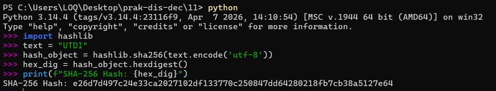
Tugas 1: Hash merupakan string unik yang terdiri atas kombinasi angka dan karakter, yang dihasilkan dari pemrosesan suatu teks menggunakan algoritma tertentu (seperti SHA-256). Meskipun teks masukan memiliki panjang yang berbeda—seperti kata "UTDI" dan kalimat "Fakultas Teknologi Informasi"—sistem akan selalu menghasilkan output hash heksadesimal dengan panjang karakter yang tetap. Karakteristik unik dan konsisten ini sangat krusial dalam arsitektur blockchain, di mana hash secara spesifik digunakan untuk mengunci sekaligus menghubungkan sekumpulan blok data di dalam jaringan agar tetap aman dan terintegrasi.

CoreBlockchain.py
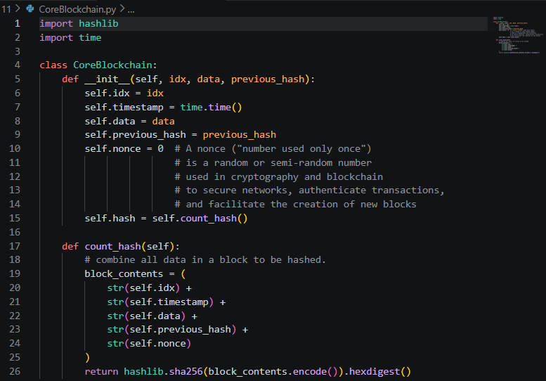

UtdiBlockchain.py
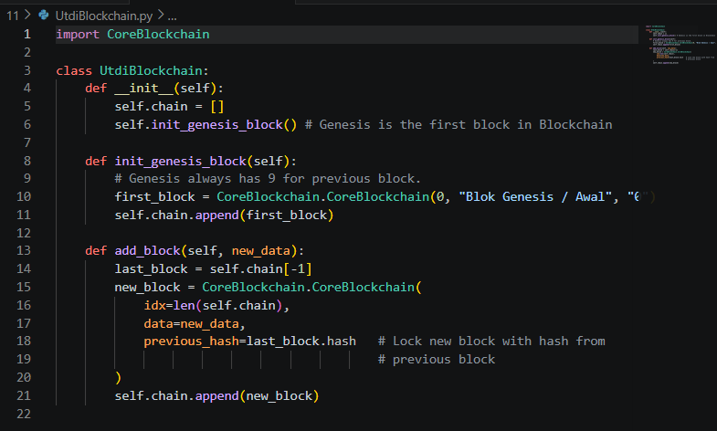

Demo penggunaan UtdiBlockchain bisa dilihat pada blockchain_demo_01.py:
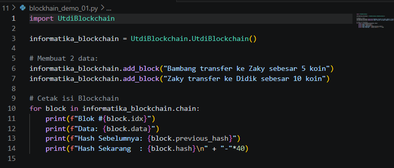

Jalankan demo tersebut:
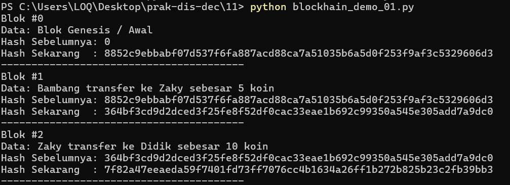

Tugas 2 : File CoreBlockchain.py bertugas mendefinisikan struktur dasar dari sebuah blok tunggal di dalam jaringan blockchain. Saat sebuah blok baru dibuat melalui fungsi inisialisasi, sistem akan mencatat nomor urut blok, waktu pembuatan, data atau informasi transaksi, nilai hash dari blok sebelumnya, serta angka acak kriptografi yang disebut nonce. Selanjutnya, seluruh kumpulan data tersebut digabungkan menjadi satu susunan teks yang utuh dan langsung diubah menjadi nilai hash unik menggunakan algoritma SHA-256 melalui fungsi count_hash. Mekanisme perhitungan ini memastikan bahwa setiap blok memiliki identitas hash yang valid dan spesifik berdasarkan isi datanya.

File UtdiBlockchain.py berfungsi sebagai manajer yang bertugas merangkai dan mengelola blok-blok yang telah didefinisikan sebelumnya. Saat modul ini diinisialisasi, sistem akan membuat sebuah daftar rantai kosong dan langsung memanggil fungsi untuk mencetak "Blok Genesis", yaitu blok pertama dalam blockchain yang memiliki nomor indeks 0 dan nilai referensi hash sebelumnya berupa "0". Ketika ada data transaksi baru yang ingin dimasukkan ke dalam jaringan, fungsi add_block akan melihat blok paling terakhir di dalam rantai, mengambil nilai hash dari blok tersebut, dan memasukkannya sebagai pengunci pada blok yang baru dibuat. Proses inilah yang membuat setiap blok saling terkait dan mengunci satu sama lain sehingga rantai tidak dapat dimanipulasi.

File blockhain_demo_01.py merupakan skrip utama yang bertindak sebagai area simulasi untuk menjalankan pengujian sistem blockchain. Skrip ini diawali dengan pembuatan objek jaringan blockchain baru bernama informatika_blockchain yang secara otomatis mencetak Blok Genesis di dalamnya. Setelah itu, skrip menambahkan dua buah blok data yang mensimulasikan transaksi, yakni transfer koin dari Bambang ke Zaky dan dari Zaky ke Didik. Pada tahap akhir, sistem melakukan perulangan untuk mencetak seluruh rincian isi rantai blockchain ke layar konsol secara berurutan, menampilkan nomor blok, data transaksi, serta membuktikan bahwa hash sebelumnya selalu selaras dengan hash pada blok pendahulunya.

## 2. Pengenalan Blockchain dan Ethereum
Pada dasarnya ada beberapa tipe blockchain: public, private, dan consortium
blockchain. Public blockchain melibatkan node di seluruh dunia dan tidak ada batasan bagi siapapun untuk bergabung ke jaringan blockchain tersebut. Private blockchain merupakan blockchain yang digunakan di lingkungan private tertentu. Secara infrastruktur sebenarnya sama dengan public blockchain tetapi hanya node pada jaringan lokal tertentu yang bisa menjadi anggotanya. Consortium blockchain merupakan blockchain yang digunakan di lebih dari satu organisasi tetapi terbatas hanya untuk anggota-anggota organisasi tersebut yang diijinkan. Pada praktikum ini, kita akan menggunakan Ethereum sebagai public blockchain (catatan: Ethereum juga mempunyai implementasi level private yang dikembangkan oleh tim dari Consensys. Lihat Hyperledger Besu di https://besu.hyperledger.org/private-networks).

Pilih sesuai browser
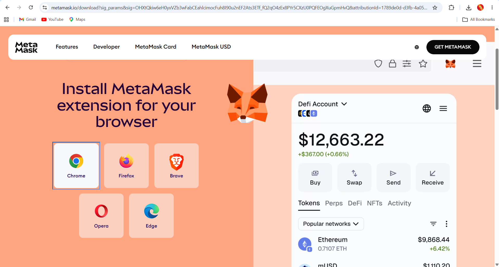

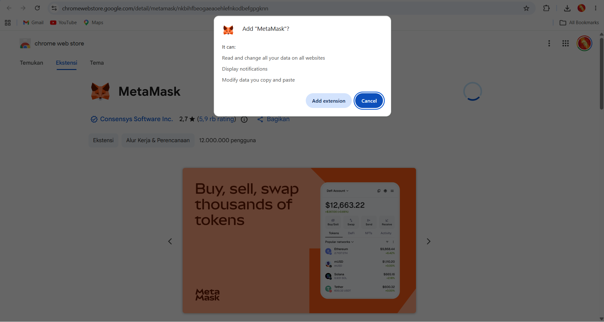

Masukkan password
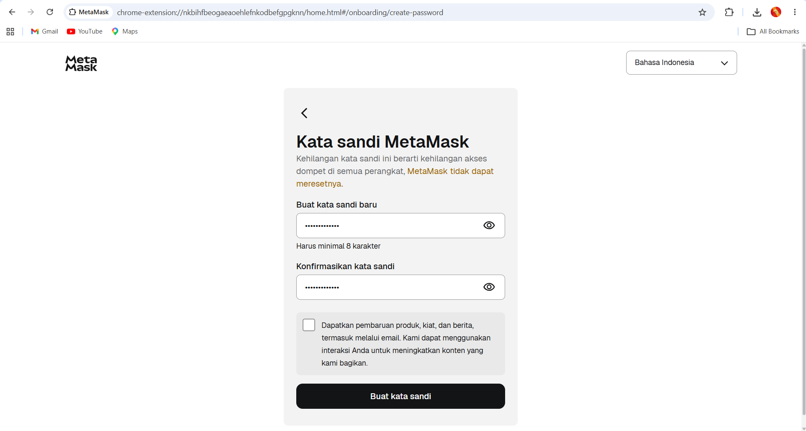

Account bisa dilihat di bagian kiri atas:
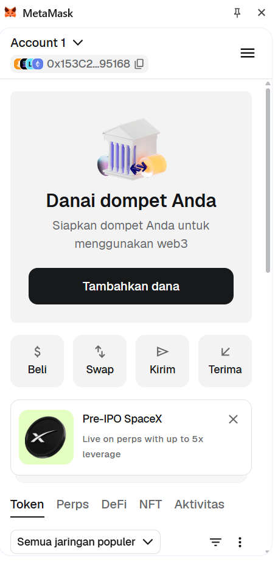

Pada posisi ini, wallet sudah bisa diisi dan bisa dilakukan pengiriman dan penerimaan cryptocurrencies. Nama account juga bisa diubah dengan memilih pada Account 1 dan kemudian memilih Rename:
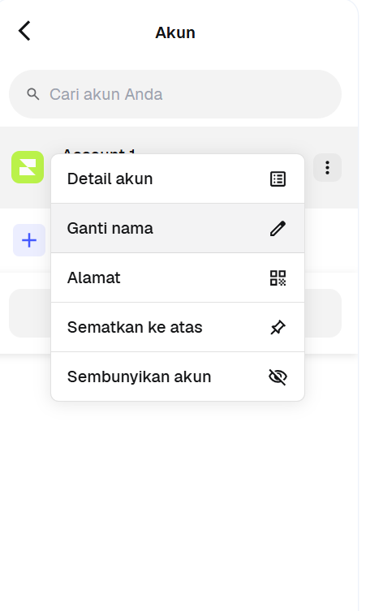

Jika ingin menggunakan public blockchain, maka kita harus membeli ETH. Jika kita ingin mencoba menggunakan untuk menguji dan mengakrabkan diri dengan proses blockchain dan cyptocurrencies, gunakan testnet. Testnet untuk Ethereum saat ini adalah Sepolia. Untuk menggunakan Sepolia, ubah Networks di MetaMask menjadi Sepolia, akses menu MetaMask, pilih Networks, kemudian aktifkan Show test networks dan pilih Sepolia:
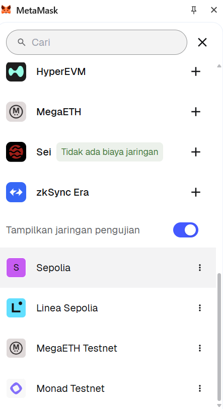

Berikut adalah tampilan setelah memilih:
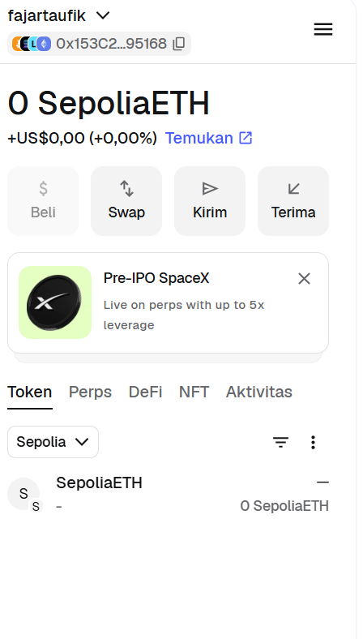

Untuk mengisi wallet, bisa dilakukan dengan membeli ETH secara nyata atau mencoba menggunakan ETH dari testnet. ETH dari testnet tidak mempunyai nilai apapun dan hanya digunakan untuk mencoba saja. Untuk meminta token ETH testnet, akses ke https://faucets.chain.link/ dan kemudian memilih Ethereum Sepolia:
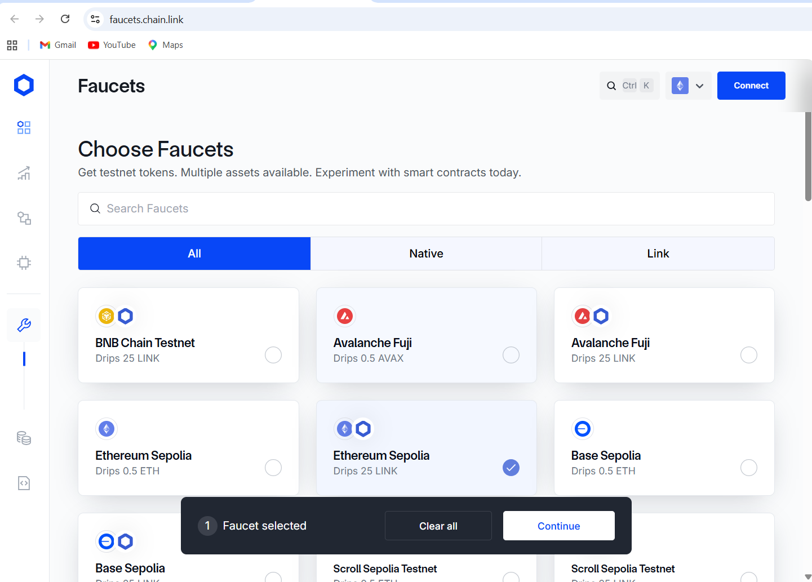

Klik pada Continue dan kemudian masukkan alamat dari Ethereum anda. Klik pada Connect:

Kemudian MetaMask akan terbuka. Klik pada Connect:
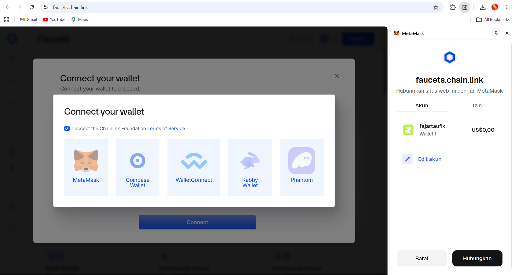

Kembali ke window sebelumnya, klik pada:

Konfirmasi Signature Request:
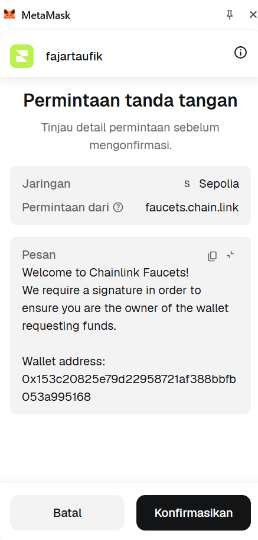

Setelah kembali ke window permintaan token, pilih Get Tokens. Tunggu sampai proses pengiriman berhasil:
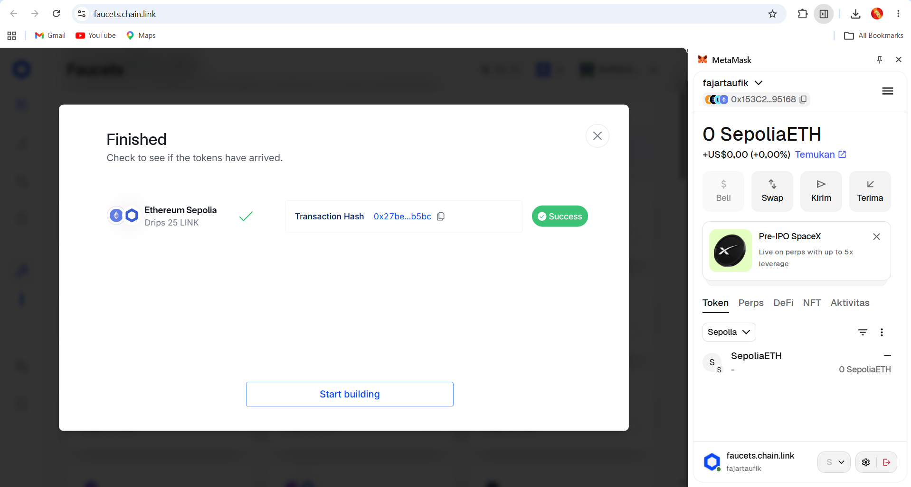

## Tugas 3:
1. Penjelasan Istilah dalam Ekosistem Blockchain

a. DApps (Decentralized Applications): Merupakan aplikasi digital atau program yang berjalan di atas jaringan peer-to-peer (P2P) atau blockchain, bukan di atas satu server terpusat yang dikendalikan oleh sebuah perusahaan. DApps menggunakan Smart Contracts untuk menjalankan logika backend-nya secara otomatis dan transparan.

b. NFT (Non-Fungible Token): Merupakan aset digital unik yang tercatat di dalam blockchain yang merepresentasikan kepemilikan atas suatu barang spesifik, baik digital maupun fisik (seperti karya seni digital, musik, atau item dalam game). Kata "Non-Fungible" berarti tidak dapat ditukar dengan rasio 1:1 secara identik (berbeda dengan uang kertas atau Bitcoin yang bersifat fungible dan nilainya sama jika ditukar).

c. DEX (Decentralized Exchange): Merupakan bursa atau platform pertukaran aset kripto yang beroperasi secara terdesentralisasi tanpa adanya perantara (seperti bank atau pialang terpusat). Transaksi jual-beli di DEX (seperti Uniswap atau SushiSwap) dilakukan secara langsung antar pengguna (peer-to-peer) dan dieksekusi secara otomatis oleh Smart Contracts.

d. Tokenization (Tokenisasi): Proses mengubah hak kepemilikan atas suatu aset (bisa berupa aset dunia nyata seperti real estat, emas, dan lukisan, atau aset surat berharga) menjadi token digital yang dicatat di dalam blockchain. Hal ini memudahkan pelacakan kepemilikan, pembagian aset menjadi fraksi-fraksi kecil (fractional ownership), dan mempercepat proses transaksi.

e. Stablecoins: Merupakan jenis mata uang kripto yang nilainya dirancang agar tetap stabil dengan cara dipatok (pegged) ke aset cadangan dunia nyata, seperti mata uang fiat (misalnya Dolar AS) atau komoditas (seperti Emas). Contoh populer adalah USDT (Tether) atau USDC. Stablecoin diciptakan untuk menghindari fluktuasi harga yang sangat ekstrem yang biasanya terjadi pada kripto seperti Bitcoin atau Ethereum.

2. Jika anda akan membangun DApps di Ethereum, peranti pengembangan apa yang
akan anda gunakan? Jelaskan mengapa anda memilih peranti pengembangan
tersebut selengkap mungkin.

Jika saya akan membangun DApps di jaringan Ethereum, peranti pengembangan utama yang akan saya gunakan adalah perpaduan antara Remix IDE dan Hardhat. Remix IDE sangat ideal untuk tahap awal pembelajaran dan pembuatan purwarupa karena berbasis web, tidak memerlukan instalasi aplikasi tambahan, serta mudah diintegrasikan dengan dompet digital seperti MetaMask untuk pengujian Smart Contract secara langsung. Namun, untuk pengembangan tingkat lanjut dan skala produksi, saya akan menggunakan Hardhat. Hardhat menjadi standar industri saat ini karena menyediakan lingkungan jaringan blockchain lokal bawaan untuk pengujian yang cepat dan tanpa biaya, memiliki fitur debugging superior (seperti kemampuan menggunakan console.log langsung di dalam bahasa Solidity), serta sangat fleksibel dikonfigurasi dengan berbagai plugin modern untuk mengotomatisasi seluruh proses kompilasi, pengujian, dan deployment aplikasi.