# Praktikum Minggu 12 - Teknologi P2P (Peer-to-Peer)

Nama  : FAJAR TAUFIK ROMADHON

NIM   : 235410072

Kelas : IF-1

Mata Kuliah : PRAKTIKUM SISTEM TERDISTRIBUSI DAN TERDESENTRALISASI

## 0. Pengantar 
Teknologi P2P terdiri atas sekumpulan nodes yang terhubung secara langsung tanpa adanya suatu server yang menjadi perantara. Jadi, node bisa berfungsi sebagai client sekaligus berfungsi sebagai server. Beberapa kemungkinan penggunaan teknologi ini adalah sebagai berikut:
1. Berbagai file / file sharing
2. Aplikasi Chat
3. Aplikasi games
Materi praktikum ini akan membahas teknologi P2P dari berbagai segi.

## 1. Koneksi antar nodes
Program berikut ini merupakan program chat sederhana menggunakan Python. Dengan mempelajari program ini, bisa diketahui bagaimana cara koneksi antar nodes dilakukan serta bagaimana cara mengirimkan message antar node tersebut.

simple_chat.py
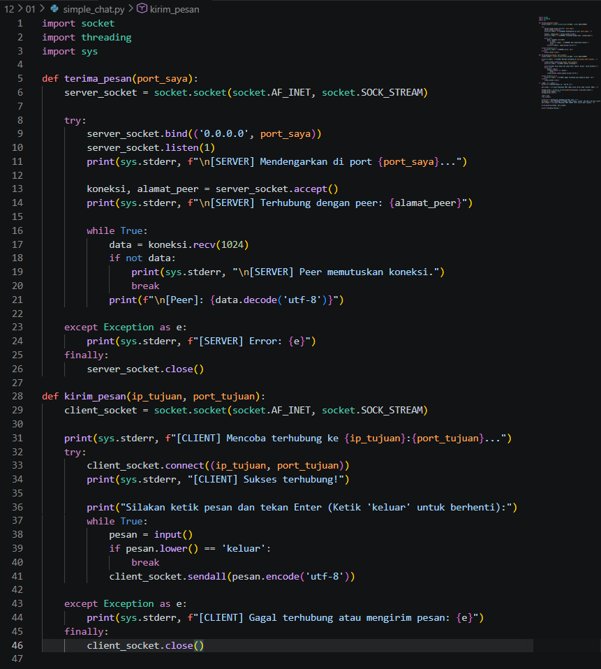
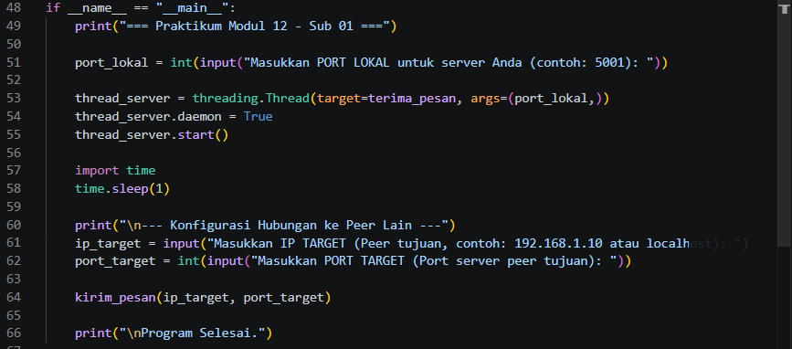

Output : 

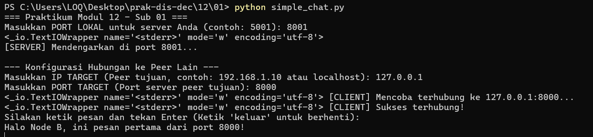

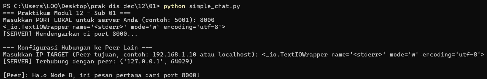 

Tugas : 
1. Di Jendela PowerShell 1 (Node A), pesan:
Halo Node B, ini pesan pertama dari port 8000!
Jendela PowerShell 2 (Node B), pesan tersebut akan muncul secara real-time.

2. a. Membuka port yang akan menerima dan mengirim pesan
Dalam jaringan P2P sederhana, setiap program bertindak sebagai Server (penerima) sekaligus Client (pengirim).
    Untuk Menerima (Sebagai Server): Program menggunakan pustaka bawaan socket. Port dibuka menggunakan perintah server_socket.bind(('0.0.0.0', port_saya)). Ini mengikat (binding) program ke port lokal yang Anda masukkan tadi (misal 8000). Setelah diikat, program memanggil server_socket.listen() agar port tersebut aktif "mendengarkan" dan menunggu ketukan dari node lain. Untuk Mengirim (Sebagai Client): Program membuka jalur keluar menggunakan perintah client_socket.connect((ip_target, port_target)). Perintah ini mengetuk pintu port node tujuan (misal ke IP 127.0.0.1 port 8001) untuk membangun "pipa" komunikasi dua arah.

    b. Menerima pesan
    Bagian penerimaan pesan dijalankan di dalam sebuah fungsi (biasanya bernama terima_pesan()) yang dibungkus oleh threading. Thread ini berjalan di latar belakang secara terus-menerus menggunakan perulangan tak terbatas (while True:). Fungsi utama yang mengeksekusi penerimaan data adalah data = koneksi.recv(1024). Perintah recv(1024) berfungsi menangkap aliran byte yang masuk maksimal sebanyak 1024 bytes per pengiriman. Pesan dalam bentuk byte tersebut kemudian diubah kembali menjadi teks biasa (di-decode) dan di-print ke layar terminal Anda.

    c. Mengirim pesan
    Proses mengirim pesan biasanya ditangani di fungsi utama saat program meminta input (ketikan) dari pengguna. Saat Anda mengetik pesan dan menekan Enter, program mengambil teks tersebut dan menggunakan fungsi koneksi.send() atau client_socket.sendall(). Sebelum dikirim melalui kabel/jaringan wifi, teks pesan buatan manusia (string) wajib diterjemahkan menjadi paket data biner dengan metode .encode('utf-8'). Paket biner inilah yang diluncurkan melalui "pipa" socket ke node tujuan.

## 2. DHT (Distributed Hash Table)
DHT merupakan mekanisme yang biasanya digunakan oleh teknologi P2P untuk pencarian data tanpa adanya server yang menyimpan semua data. Jika pernah menggunakan Bittorents, DHT merupakan salah satu komponen untuk pencarian dan koneksi ke node lainnya untuk keperluan mengambil file. Berikut adalah simulasi DHT menggunakan Python.

dht.py
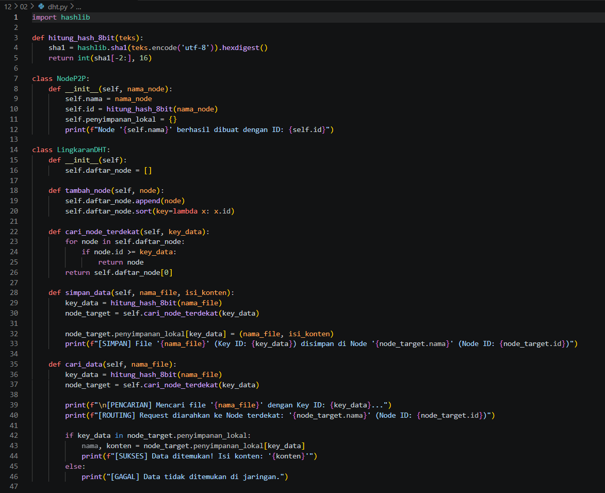
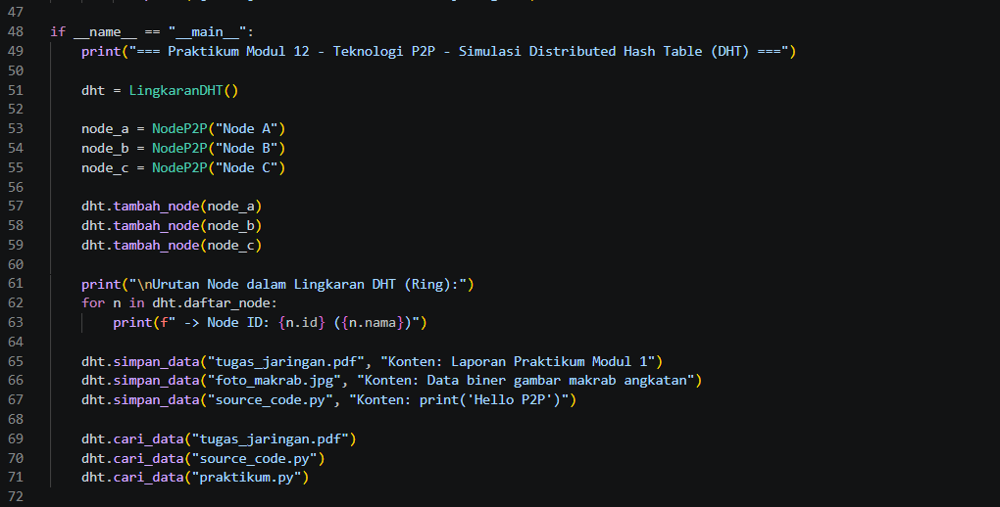

Tugas : 
1. Output program 
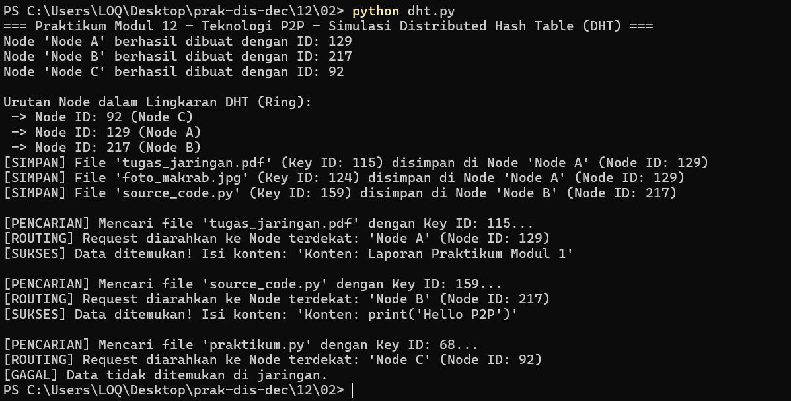

2. Program dht.py mensimulasikan mekanisme Distributed Hash Table (DHT) secara sederhana menggunakan struktur data Ring (lingkaran). Secara singkat, program ini melakukan hal berikut:

    - Membuat 3 node P2P fiktif (Node A, Node B, Node C) dan memberikan ID unik (Hash 8-bit) untuk masing-masing node.  
    - Menggabungkan ketiga node tersebut ke dalam sebuah daftar Ring yang diurutkan berdasarkan ID node dari yang terkecil ke terbesar.
    - Mendemonstrasikan proses penyimpanan file. Saat file disimpan, nama file di-hash menjadi sebuah ID kunci (Key ID). Program lalu mencari node mana yang ID-nya paling dekat dengan Key ID file tersebut, lalu menyimpan file di penyimpanan lokal node itu.  
    - Mendemonstrasikan proses pencarian file dengan melakukan hashing pada nama file yang dicari, lalu merutekan (routing) permintaan ke node yang sebelumnya ditunjuk untuk memegang data tersebut.

3. Dalam jaringan P2P nyata, tidak ada server pusat. DHT memecahkan masalah pencarian data dengan cara memetakan "Data" dan "Node" ke dalam ruang alamat hash yang sama. Algoritma Pencarian DHT dalam program:
    - Hashing (Pemetaan): Nama file yang dicari (misal: tugas_jaringan.pdf) diubah menjadi nilai angka (Key ID) menggunakan fungsi hash SHA-1 yang disederhanakan menjadi 8-bit.
    - Routing (Pencarian Node Terdekat): Sistem melihat daftar node di dalam jaringan yang sudah diurutkan (Ring). Sistem membandingkan Key ID file dengan ID masing-masing node.
    - Penentuan Target: Sistem memilih node pertama yang memiliki ID lebih besar atau sama dengan ($\ge$) Key ID file. Jika Key ID file lebih besar dari semua ID node yang ada, sistem akan memutar kembali ( wrap-around ) dan menunjuk node pertama di awal Ring.
    - Pengambilan Data: Setelah node target ditemukan, permintaan langsung diarahkan ke node tersebut untuk mengecek apakah Key ID file ada di penyimpanannya. Jika ada, konten data dikembalikan ke peminta. 

## 3. Torrent
Torrent adalah teknologi berbagi file peer-to-peer (P2P) yang memungkinkan pengguna mengunduh dan mengunggah file langsung antar perangkat tanpa melalui server pusat. Teknologi ini biasanya digunakan untuk mendistribusikan file berukuran sangat besar secara cepat dan efisien.

read_torrent.py
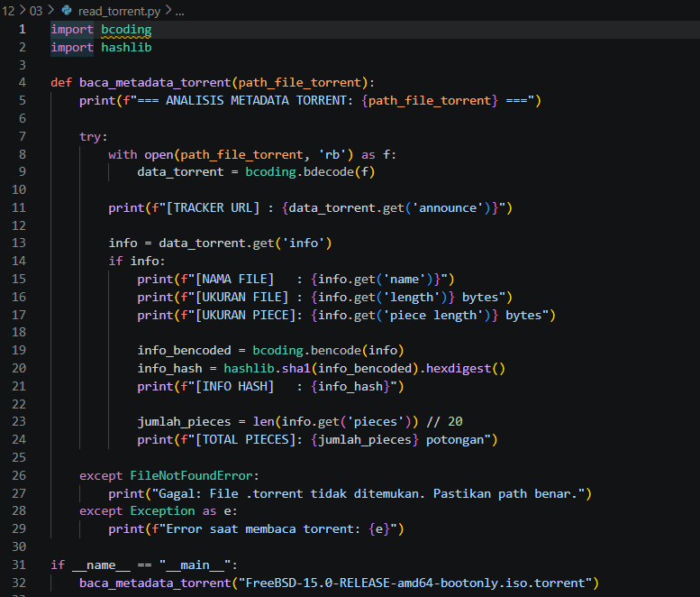

Tugas : 
1. Output program 
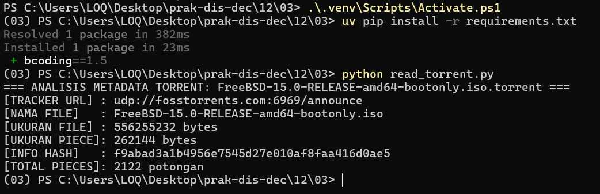

2. Program ini memberi output berupa rincian metadata karena ia membaca dan memecah ( decode ) isi file biner berekstensi .torrent menggunakan pustaka bcoding. File .torrent sebenarnya tidak berisi file aslinya, melainkan berisi informasi "peta" seperti URL Tracker (server pelacak peer), nama file asli, total ukuran file, dan pembagian ukuran potongan (piece). Program juga menghitung Info Hash menggunakan algoritma SHA-1, yang mana hash ini digunakan oleh aplikasi client torrent untuk memverifikasi keutuhan data dan mencari ketersediaan file tersebut di jaringan P2P (Swarm).

3. Modifikasi Program
    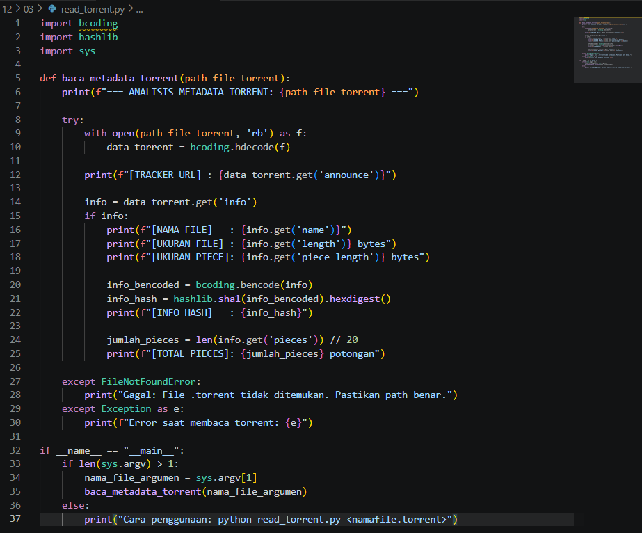

    Output : 

    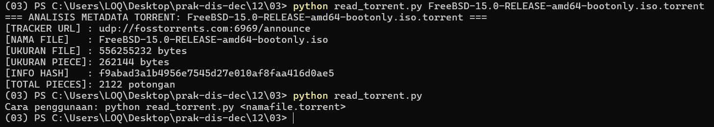
    Modifikasi penambahan sys.argv pada program dilakukan agar program menjadi lebih fleksibel. Nama file .torrent kini tidak lagi diketik secara permanen (hardcoded) di dalam source code, melainkan dibaca sebagai argumen atau parameter langsung dari ketikan perintah di terminal.

    Keluaran (output) yang dihasilkan memang tampak sama karena file ISO yang dianalisis kebetulan sama. Namun secara sistem, program kini jauh lebih dinamis karena bisa langsung digunakan untuk membaca file .torrent apa pun hanya dengan mengganti nama file di terminal, tanpa perlu membongkar dan mengedit kode Python-nya lagi.