# Praktikum Minggu 13 - Konsensus pada Blockchain

Nama  : FAJAR TAUFIK ROMADHON

NIM   : 235410072

Kelas : IF-1

Mata Kuliah : PRAKTIKUM SISTEM TERDISTRIBUSI DAN TERDESENTRALISASI

## 0. Pengantar 
Solana merupakan platform blockchain yang dikenal mempunyai kinerja tinggi. Solana dirancang khusus untuk mengatasi masalah skalabilitas tanpa mengorbankan keamanan atau desentralisasi. Berbeda dengan blockchain tradisional seperti Bitcoin atau Ethereum yang membutuhkan waktu belasan detik hingga beberapa menit untuk memproses blok, Solana mampu memproses hingga puluhan ribu transaksi per detik (TPS) dengan biaya yang sangat murah. Keunggulan kecepatan ini membuat Solana menjadi blockchain L1 yang ideal untuk aplikasi terdesentralisasi (dApps), decentralized finance (DeFi), dan pasar NFT berskala global yang membutuhkan respons jaringan secara instan.

Solana juga mempunyai Solana Permissioned Environments (SPE). SPE adalah instan privat yang disesuaikan dari Solana Virtual Machine (SVM) dan dirancang untuk digunakan secara khusus di dalam ruang lingkup organisasi. SPE menyediakan infrastruktur blockchain Solana tetapi dengan kendali penuh atas validasi, akses jaringan, biaya transaksi, dan tata kelola. Ini hal yang menarik karena selain bisa digunakan untuk publik, Solana juga bisa digunakan untuk level enterprise.

## 1. Instalasi dan Persiapan
Untuk mulai menggunakan Solana, kita akan melakukan instalasi software Solana, khususnya
yang digunakan untuk pengembangan aplikasi. Beberapa prasyarat yang harus diinstall terlebih
dahulu adalah:
1. Rust
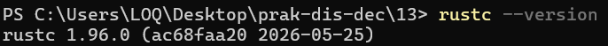

2. Node.js
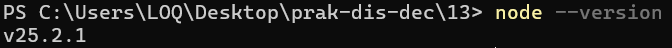

Setelah itu, install Solana CLI dan konfigurasikan env variable PATH:

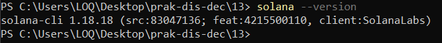

Solana juga mengembangkan framework untuk DApp berbasis Solana dengan nama Anchor
(https://www.anchor-lang.com/docs - https://github.com/otter-sec/anchor). Install Anchor berikut ini:

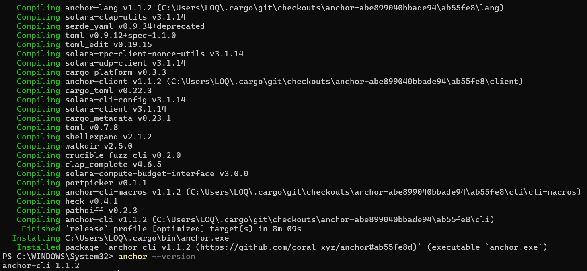

Berikut ini cara membuat address wallet Solana. Akan dibuat 2 address:
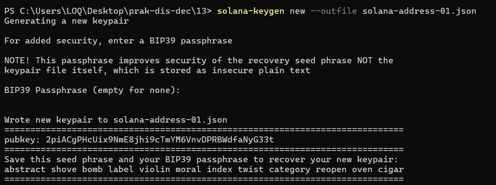

Catat BIP39 Passphrase yang digunakan serta seed phrase (ada di bagian bawah - diblok merah),
jangan sampai hilang atau lupa dan jangan sampai diketahui orang lain. Address ke 2:

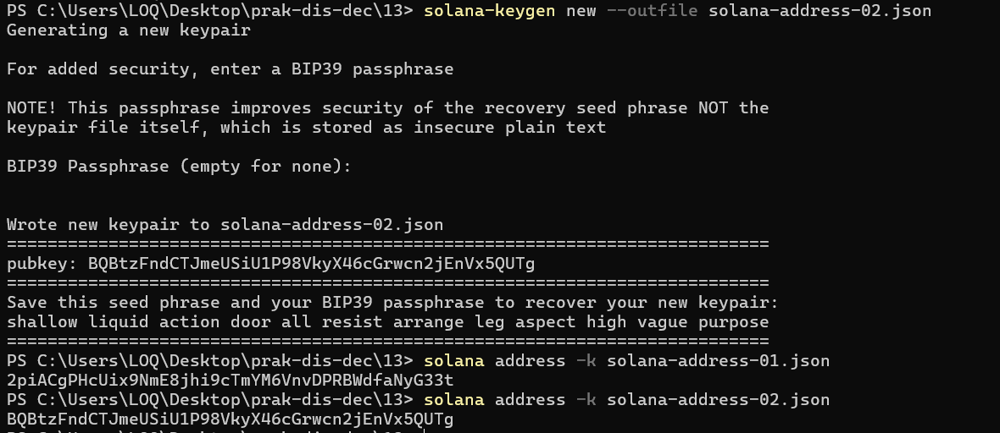

Berikut adalah alamat yang dihasilkan:
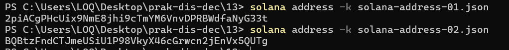

## 2. Konsensus pada Solana Blockchain
Solana mampu memproses hingga puluhan ribu transaksi per detik (TPS) dengan biaya yang sangat murah. Kunci utama untuk efisiensi Solana tersebut terletak pada arsitektur konsensus yang merupakan penggabungan antara Proof of Stake (PoS) dan Proof of History (PoH). PoS berfungsi sebagai lapisan keamanan untuk menentukan validator berdasarkan jumlah token yang dipertaruhkan (stake), PoH bertindak sebagai "jam digital kriptografis" yang mencatat urutan waktu dan jalannya setiap transaksi secara berurutan sebelum konsensus PoS dimulai. Dengan adanya pembuktian waktu historis yang terintegrasi ini, para validator di seluruh dunia tidak perlu lagi saling berkomunikasi secara intensif hanya untuk menyepakati kapan sebuah transaksi terjadi, sehingga proses finalisasi data dapat berjalan jauh lebih cepat dan sinkron

## 3. Memperoleh SOL dari Devnet
Solana mempunya cryptocurrency SOL. SOL akan digunakan untuk keperluan semua transaksi Solana dengan akses publik. Sama halnya dengan Ethereum, Solana juga mempunyai Devnet yang merupakan jaringan untuk keperluan pengembangan dan pengujian aplikasi. Pada Devnet ini, bisa diperoleh SOL versi Devnet (tentu saja tidak laku di mainnet). Berikut adalah langkah untuk mendapatkan SOL di Devnet.

a. Atur akses Solana ke Devnet:
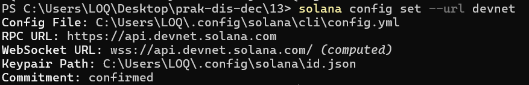

b. Airdrop dan Cek Saldo.
Pada bagian ini, sudah harus tersedia alamat wallet dari Solana (telah dibuat pada dokumen sebelumnya). Kita akan meminta 5 SOL di Devnet. Sebenarnya SOL Devnet bisa diminta dari Solana CLI, tetapi biasanya gagal. Akses ke https://faucet.solana.com/ dan login menggunakan akun GitHub. Setelah itu masukkan alamat wallet serta jumlah yang diinginkan. Pilih 5 SOL untuk jumlah yang diinginkan.

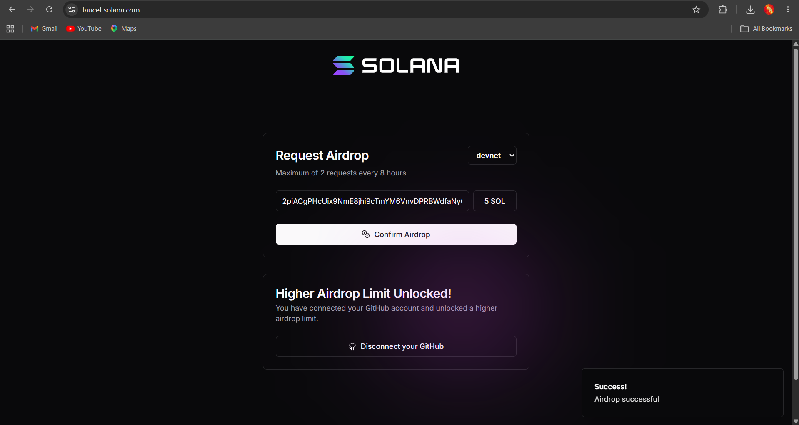
Periksa hasilnya:
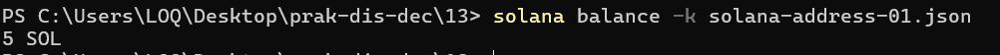

## 4. Alur Konsensus pada Solana Blockchain
Konsensus di Solana merupakan kombinasi Proof of History (PoH) dan Proof of Stake (PoS). PoH berfungsi mengatur urutan transaksi dan slot secara kriptografis, sedangkan PoS menentukan validator yang menjadi leader serta memberikan mekanisme voting untuk mencapai kesepakatan.
Konsensus tercapai ketika hasil urutan PoH divalidasi dan disetujui melalui voting PoS hingga status finalized.

1. Transfer SOL
Alamat wallet bisa menerima transfer. Secara default, jika alamat wallet tujuan belum ada isinya, maka Solana CLI akan menolak mengirimkan ke alamat wallet tujuan tersebut. Jika ingin tetap mengirimkan, gunakan parameter –allow-unfunded-recipient.
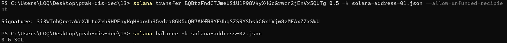

2. PoH
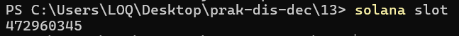
Slot merupakan hasil pengurutan waktu transaksi.

3. Tampilkan Detail dari Slot
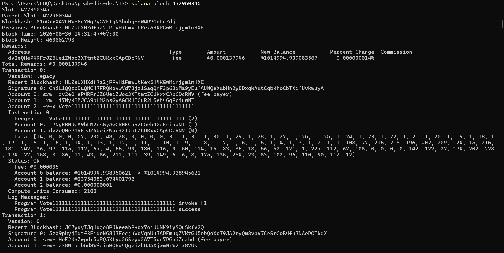
Transaksi tersebut divalidasi oleh banyak validator. Siapapun bisa menjadi validator asal mempunyai resources yang cukup untuk menjalankan Agave Validator Client. Spesifikasi yang biasany diperlukan: minimum 12-24 cores untuk CPU, 256 GB+ RAM, dan SSD level enterprise.

4. Menampilkan Validators
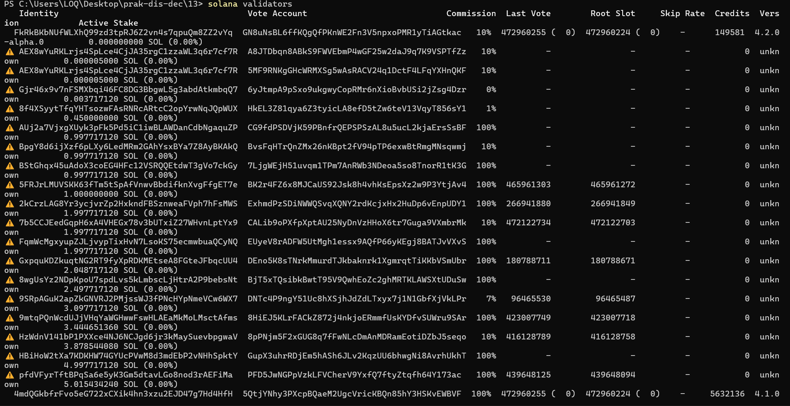
Lihat Active Stake. Bagian tersebut menunjukkan stake yang dimiliki validator. Semakin besar stake, semakin berpengaruh validator tersebut.
Pada daftar validators, terdapat kolom Vote Account. Account tersebut merupakan account yang ikut voting. Untuk mengetahui lebih detail dari account yang vote, gunakan
Jika diformat dengan baik, terdapat beberapa data yang bisa digunakan untuk membuktikan bahwa
telah terjadi voting (lastVote):
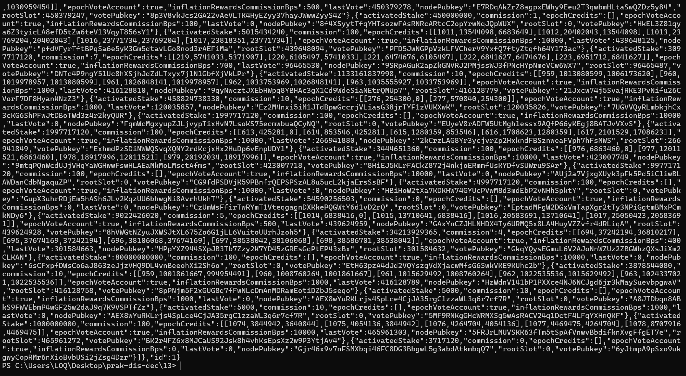

## 5. Periksa Hasil Akhir Proses
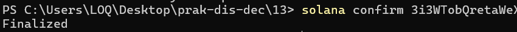

Hasil tersebut juga bisa dilihat dari Web pada URL https://explorer.solana.com. JIka pada posisi kanan tertulis selain Devnet, ubah ke Devnet dengan klik pada tombol tulisan tersebut dan kemudian pilih Devnet. Isikan signature dari transaksi di atas ke bagian Search. Setelah transaksi dengan signature tersebut ditemukan, tampilkan:

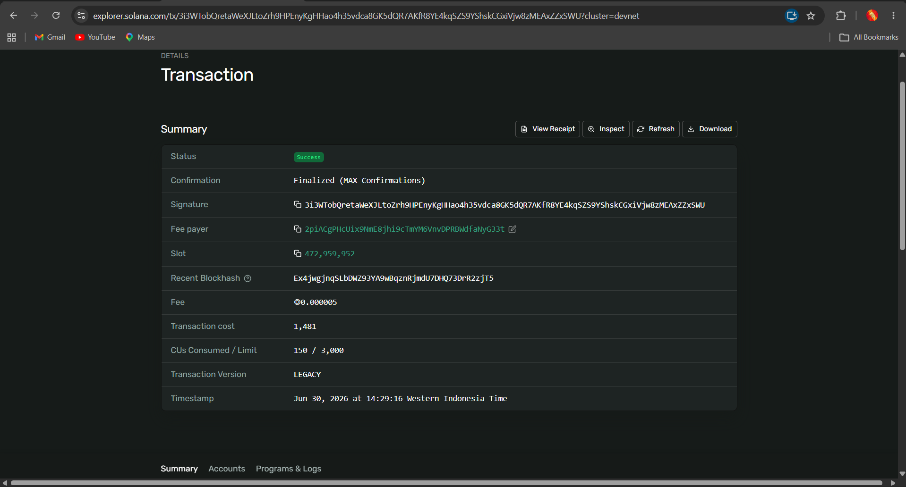

Pada Confirmation tertulis Finalized (MAX Confirmations). Hal ini menunjukkan bahwa transaksi
telah selesai diproses dan dituliskan ke blok. Finalized berarti konsensus telah dicapai dan transaksi ditulis ke blok.