# Praktikum Minggu 14 - Smart Contract pada Blockchain

Nama  : FAJAR TAUFIK ROMADHON

NIM   : 235410072

Kelas : IF-1

Mata Kuliah : PRAKTIKUM SISTEM TERDISTRIBUSI DAN TERDESENTRALISASI

## 1. Pengantar 
Solana menggunakan Rust untuk membangun smart contract-nya. Dengan demikian, untuk
membuat smart contract di Solana, peranti pengembangan Rust sudah harus terinstall dengan benar. Catatan ini merupakan sub bagian dari catatan yang ada di https://solana.com/docs/programs/rust dengan beberapa pengembangan. Dengan mempraktekkan catatan ini, diharapkan mahasiswa mempunya gambaran umum tentang smart contract. Jika berminat lebih lanjut, maka diharapkan menguasai bahasa pemrograman Rust.

## 2. Smart Contract di Solana - Native Rust
Buat proyek baru di Rust menggunakan cargo kemudian tambahkan pustaka untuk Solana.

$ cargo new hello_solana –lib

$ cd hello_solana

$ cargo add solana-program
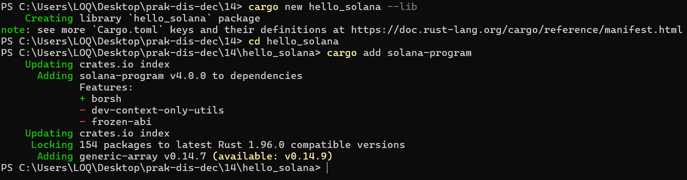

Edit Cargo.toml
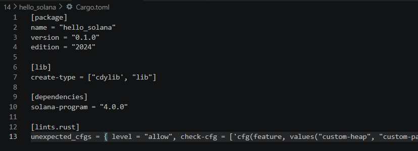

Ganti src/lib.rs
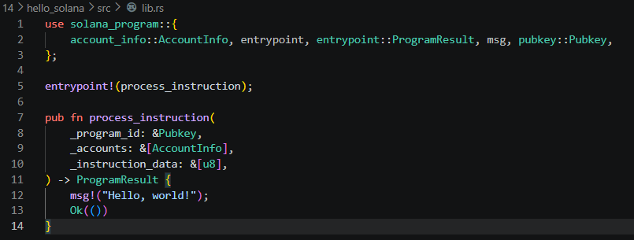

Build source code smart contract tersebut menggunakan perintah cargo build-sbf. Perintah ini
spesifik untuk Solana. Saat mengerjakan perintah tersebut, cargo akan menginstall semua tools yang diperlukan (jika belum ada):
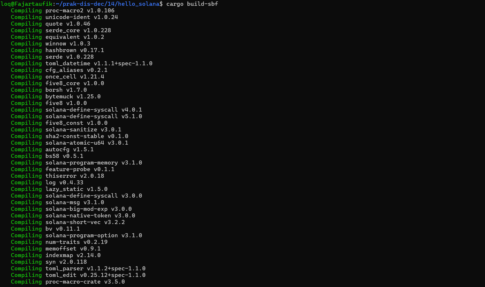

Hasilnya bisa dilihat pada direktori target/deploy:
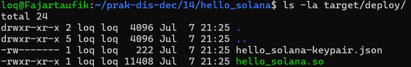

Buat Keypair Default
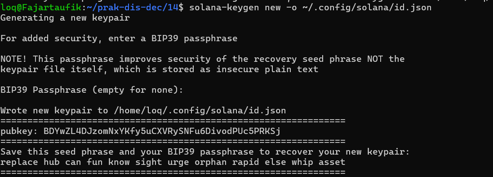

Dapatkan SOL dari localnet
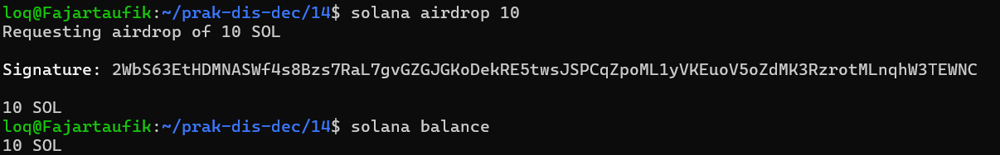

Deploy Program dengan Program ID dari File Keypair
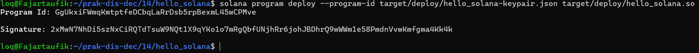

melihat block
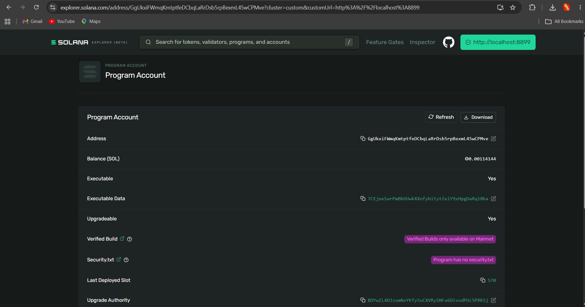

## 3. Smart Contract di Solana - Menggunakan Anchor Framework
Untuk mengerjakan langkah-langkah berikut, pastikan Solana CLI dan Anchor sudah terinstall,
demikian juga dengan Rust, Node.js, dan Yarn di Node.js 
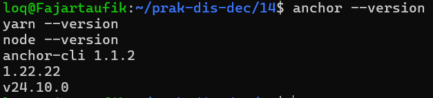

Membuat proyek baru:
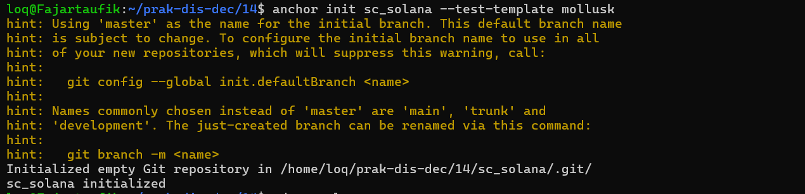

Build program yang dihasilkan dari perintah init tersebut:
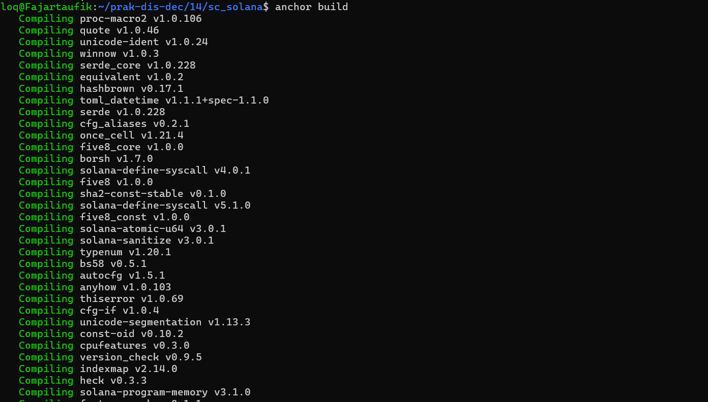

Hasil bisa dilihat di direktori target/deploy:
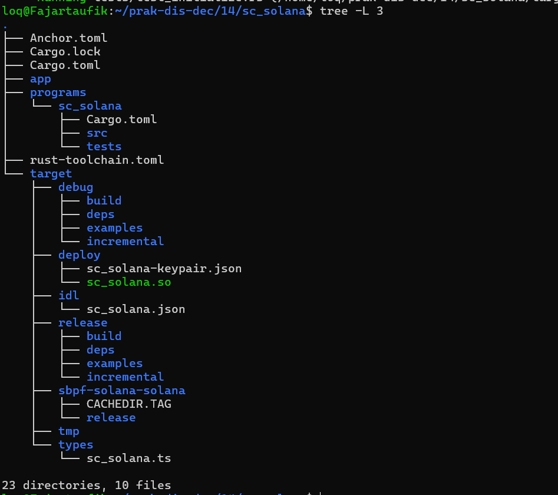

Untuk proses pengujian, gunakan perintah anchor test:
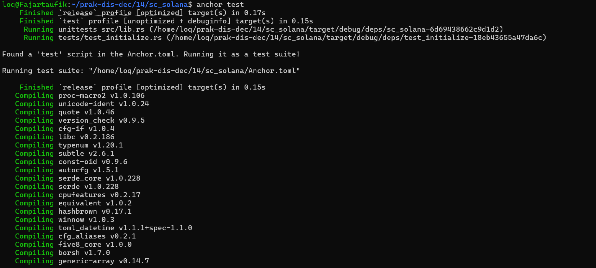

Hasil pengujian adalah sebagai berikut:
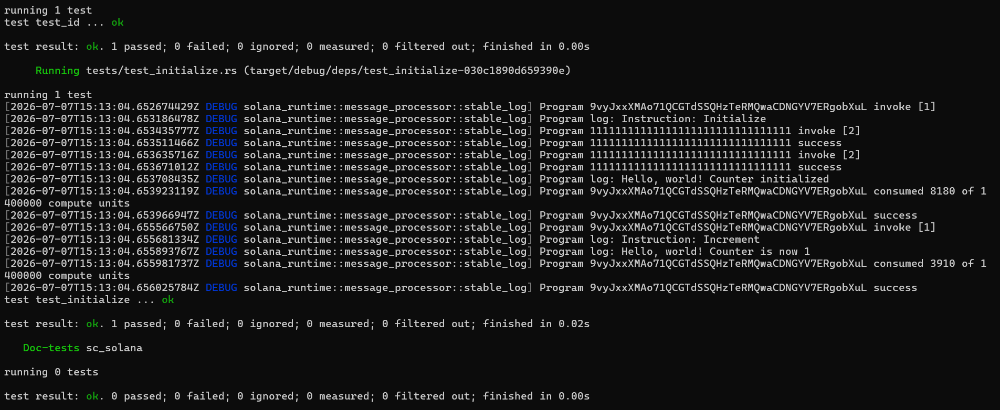

Deploy dengan perintah anchor deploy (atau versi terbaru, disarankan menggunakan anchor
program deploy):
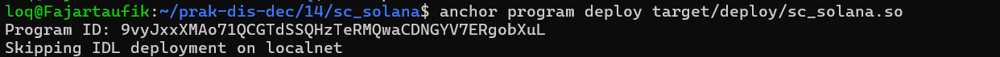

Catat program id, kemudian masukkan program id ke Solana Explorer untuk Devnet. Berikut adalah
hasilnya:
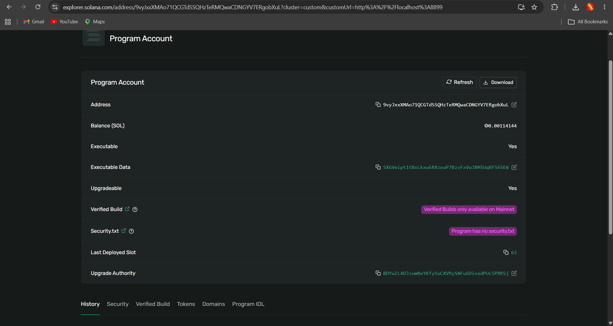